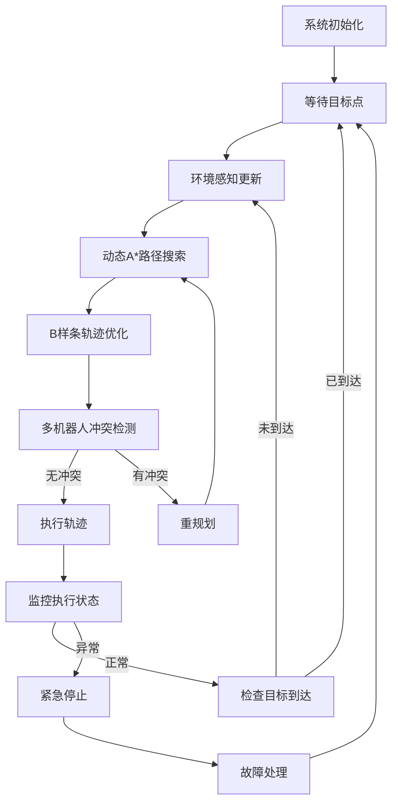

# EGO-Planner-Swarm 规划系统

## 系统概述

EGO-Planner-Swarm是一个面向多机器人系统的智能路径规划框架，基于ROS2构建，专为复杂动态环境中的多机器人协调导航设计。该系统采用分层架构，将复杂的多机器人规划问题分解为环境感知、路径搜索、轨迹优化、多机器人协调等模块，实现了高效、安全、实时的多机器人路径规划。

## 系统架构

```
┌─────────────────────────────────────────────────────────────────┐
│                    EGO-Planner-Swarm 规划系统                      │
├─────────────────────────────────────────────────────────────────┤
│  ┌─────────────┐  ┌─────────────┐  ┌─────────────┐  ┌─────────────┐ │
│  │ plan_manage │  │ path_search │  │ bspline_opt │  │ traj_utils  │ │
│  │(核心调度器)  │  │(路径搜索)   │  │(轨迹优化)   │  │(轨迹工具)   │ │
│  └─────────────┘  └─────────────┘  └─────────────┘  └─────────────┘ │
│  ┌─────────────┐  ┌─────────────┐  ┌─────────────┐                │
│  │  plan_env   │  │drone_detect │  │tcp_bridge   │                │
│  │(环境感知)   │  │(机器人检测) │  │(通信桥接)   │                │
│  └─────────────┘  └─────────────┘  └─────────────┘                │
└─────────────────────────────────────────────────────────────────┘
```

## 模块详述

### 1. 🧠 plan_manage - 规划管理器
**作用**: 系统核心调度器，实现基于有限状态机的规划流程控制

**主要功能**:
- 有限状态机管理 (7个状态: INIT→WAIT_TARGET→GEN_NEW_TRAJ→EXEC_TRAJ→REPLAN_TRAJ→EMERGENCY_STOP→SEQUENTIAL_START)
- 规划任务调度和协调
- 多机器人冲突检测和解决
- 紧急情况处理和故障恢复

**技术特点**:
- 实时状态监控和切换
- 分布式多机器人协调
- 完备的故障处理机制

### 2. 🗺️ plan_env - 环境感知模块
**作用**: 构建和维护规划所需的3D环境表示

**主要功能**:
- 3D占用网格地图构建
- 欧几里得距离场(ESDF)计算
- 动态障碍物检测和预测
- 多传感器数据融合

**技术特点**:
- 贝叶斯概率占用更新
- 增量式距离场计算
- 实时动态环境适应

### 3. 🔍 path_searching - 路径搜索模块
**作用**: 在复杂环境中寻找初始可行路径

**主要功能**:
- 动态A*算法实现
- 运动学约束处理
- 时空冲突避免
- 多机器人优先级搜索

**技术特点**:
- 毫秒级搜索响应
- 内存池优化管理
- 完备性和最优性保证

### 4. 📈 bspline_opt - B样条轨迹优化
**作用**: 将粗糙路径优化为平滑可执行轨迹

**主要功能**:
- B样条轨迹参数化
- 多目标梯度优化
- 动力学约束处理
- 多机器人协调优化

**技术特点**:
- L-BFGS高效优化算法
- 稀疏梯度计算
- 并行优化处理

### 5. 🛠️ traj_utils - 轨迹工具库
**作用**: 提供统一的轨迹数据结构和处理工具

**主要功能**:
- 轨迹消息定义和管理
- B样条数学算法实现
- 轨迹评估和验证工具
- 可视化和调试支持

**技术特点**:
- 标准化消息接口
- 数值稳定的算法实现
- 丰富的工具函数

### 6. 👁️ drone_detect - 机器人检测模块
**作用**: 实现多机器人间的相互感知和检测

**主要功能**:
- 点云和视觉机器人检测
- 卡尔曼滤波状态跟踪
- 多传感器数据融合
- 运动预测和关联

**技术特点**:
- "Fake Person"检测原理
- 鲁棒的目标跟踪
- 高频状态估计

### 7. 🌐 rosmsg_tcp_bridge - 通信桥接器
**作用**: 实现多机器人间的网络通信和数据同步

**主要功能**:
- TCP/UDP双协议支持
- 轨迹和状态信息同步
- 环形网络拓扑管理
- 消息序列化处理

**技术特点**:
- 低延迟网络通信
- 可靠的数据传输
- 自动网络恢复

## 系统工作流程

### 🔄 完整规划循环



### 📊 数据流向图

```
传感器数据 → plan_env → 环境地图
     ↓
目标点输入 → plan_manage → 规划任务
     ↓
环境地图 → path_searching → 初始路径
     ↓
初始路径 → bspline_opt → 优化轨迹
     ↓
优化轨迹 → tcp_bridge → 其他机器人
     ↓
多机器人轨迹 → plan_manage → 冲突检测
     ↓
最终轨迹 → traj_utils → 控制器
```

## 关键技术特性

### ⚡ 实时性能
- **规划频率**: 10-50Hz 实时重规划
- **搜索速度**: 毫秒级路径搜索
- **优化效率**: 快速收敛的梯度优化
- **通信延迟**: <10ms 网络同步

### 🛡️ 安全保障
- **多层碰撞避免**: 路径搜索 + 轨迹优化 + 实时监控
- **动力学约束**: 严格的速度、加速度限制
- **紧急停止**: 快速响应的安全机制
- **故障恢复**: 完备的异常处理流程

### 🤖 多机器人协调
- **分布式架构**: 无中心化的自主规划
- **冲突避免**: 时空维度的冲突检测
- **优先级机制**: 公平的资源分配策略
- **通信容错**: 网络故障的自动恢复

### 🔧 系统适应性
- **动态环境**: 实时感知和地图更新
- **参数可调**: 灵活的系统配置
- **模块化设计**: 便于功能扩展
- **跨平台支持**: ROS2标准接口

## 快速开始

### 1. 环境依赖
```bash
# ROS2 Humble
sudo apt install ros-humble-desktop

# 依赖库
sudo apt install libeigen3-dev libboost-all-dev
sudo apt install ros-humble-pcl-conversions ros-humble-cv-bridge
```

### 2. 编译系统
```bash
cd /path/to/your/workspace
colcon build --packages-select \
    plan_env path_searching bspline_opt \
    plan_manage traj_utils drone_detect \
    rosmsg_tcp_bridge
```

### 3. 单机器人启动
```bash
# 启动规划系统
ros2 run ego_planner ego_planner_node

# 在RViz中设置目标点
ros2 run rviz2 rviz2 -d ego_planner_config.rviz
```

### 4. 多机器人启动
```bash
# 机器人0
ros2 run ego_planner ego_planner_node --ros-args -p drone_id:=0

# 机器人1
ros2 run ego_planner ego_planner_node --ros-args -p drone_id:=1

# 通信桥接
ros2 run rosmsg_tcp_bridge bridge_node --ros-args -p drone_id:=0
```

## 配置参数

### 🎛️ 核心参数配置
```yaml
# 规划参数
planning_horizon: 7.5        # 规划距离(m)
replan_thresh: 1.0          # 重规划阈值(m)
max_vel: 2.0               # 最大速度(m/s)
max_acc: 2.0               # 最大加速度(m/s²)

# 地图参数
resolution: 0.1            # 地图分辨率(m)
map_size: [40, 40, 5]      # 地图尺寸(m)
safe_distance: 0.3         # 安全距离(m)

# 多机器人参数
drone_id: 0                # 机器人ID
swarm_safe_distance: 0.5   # 机器人间安全距离(m)
```

## 性能基准

### 📈 典型性能指标
| 指标 | 单机器人 | 多机器人(4台) |
|------|----------|---------------|
| 规划频率 | 20-50Hz | 10-20Hz |
| 搜索时间 | 1-5ms | 2-10ms |
| 优化时间 | 5-20ms | 10-50ms |
| 内存使用 | 100-200MB | 150-300MB |
| CPU使用率 | 10-30% | 20-50% |

### 🎯 适用场景
- **室内导航**: 办公楼、仓库、工厂环境
- **无人机集群**: 编队飞行、协同作业
- **地面机器人**: AGV、配送机器人
- **混合系统**: 空地协同、异构机器人

## 调试和可视化

### 🔍 调试工具
- **RViz可视化**: 实时轨迹和地图显示
- **性能监控**: CPU、内存、网络统计
- **状态机跟踪**: 规划状态变化日志
- **参数调优**: 动态参数调整工具

### 📊 可视化内容
- 3D占用网格地图
- 动态A*搜索过程
- B样条轨迹和控制点
- 多机器人轨迹对比
- 碰撞检测结果
- 网络通信状态

## 扩展开发

### 🔌 接口扩展
- **新传感器**: 添加自定义传感器支持
- **控制器**: 对接不同的机器人控制器
- **规划算法**: 集成新的路径规划算法
- **通信协议**: 支持其他网络通信方式

### 🧩 模块定制
- **环境表示**: 扩展地图表示方法
- **约束条件**: 添加新的约束类型
- **优化目标**: 定制轨迹优化目标
- **协调策略**: 实现新的多机器人协调方法

## 常见问题

### ❓ 故障排除
1. **规划失败**: 检查目标点可达性，调整规划参数
2. **频繁重规划**: 优化感知精度，调整重规划阈值
3. **多机器人冲突**: 检查网络连接，调整安全距离
4. **性能问题**: 调整地图分辨率，优化计算参数

### 💡 性能优化建议
- 根据实际需求调整地图分辨率
- 合理设置规划频率和计算时间限制
- 优化网络拓扑减少通信延迟
- 使用多线程并行处理提高效率

## 技术支持

### 📚 相关文档
- [规划管理器详细文档](plan_manage/README.md)
- [环境感知模块文档](plan_env/README.md)
- [路径搜索算法文档](path_searching/README.md)
- [轨迹优化模块文档](bspline_opt/README.md)
- [轨迹工具库文档](traj_utils/README.md)
- [机器人检测文档](drone_detect/README.md)
- [通信桥接器文档](rosmsg_tcp_bridge/README.md)

### 🔗 相关链接
- [EGO-Planner原论文](https://arxiv.org/abs/2008.08835)
- [Fast-Planner项目](https://github.com/HKUST-Aerial-Robotics/Fast-Planner)
- [ROS2官方文档](https://docs.ros.org/en/humble/)

---

**EGO-Planner-Swarm**: 下一代多机器人智能规划系统 🚁🤖✨ 