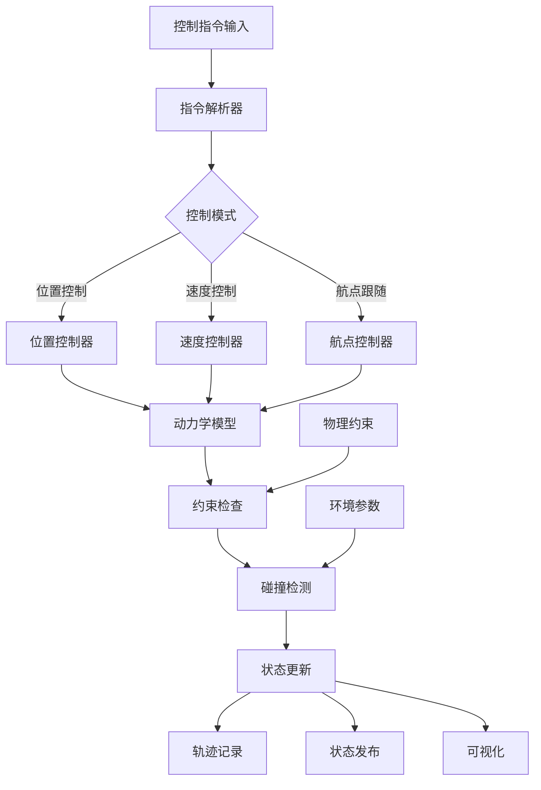

# Fake Drone

## 📖 包概述

伪无人机模块是EGO-Planner系统的轻量级无人机仿真组件，主要用于测试、调试和快速原型验证。该模块提供简化的无人机动力学模型，支持基本的位置和速度控制，适用于算法验证、系统集成测试和教学演示等场景。

## 🎯 主要功能

### 核心仿真能力
- **简化动力学模型**: 基于质点运动的无人机仿真
- **位置/速度控制**: 支持位置指令和速度指令控制
- **状态发布**: 实时发布无人机位姿和运动状态
- **轨迹记录**: 记录和回放无人机飞行轨迹
- **碰撞检测**: 基本的环境碰撞检测功能

### 仿真模式支持
```cpp
// 伪无人机仿真模式定义
enum class SimulationMode {
    POSITION_CONTROL,   // 位置控制模式
    VELOCITY_CONTROL,   // 速度控制模式  
    WAYPOINT_FOLLOW,    // 航点跟随模式
    TRAJECTORY_TRACK,   // 轨迹跟踪模式
    MANUAL_CONTROL      // 手动控制模式
};

struct DroneState {
    Eigen::Vector3d position;     // 当前位置 [m]
    Eigen::Vector3d velocity;     // 当前速度 [m/s]
    Eigen::Vector3d acceleration; // 当前加速度 [m/s²]
    double yaw;                   // 偏航角 [rad]
    double yaw_rate;              // 偏航角速度 [rad/s]
    rclcpp::Time timestamp;       // 时间戳
};
```

## 📡 ROS2接口定义

### 订阅话题 (Subscribers)

| 话题名称 | 消息类型 | 频率 | 功能描述 |
|----------|----------|------|----------|
| `position_cmd` | `quadrotor_msgs/PositionCommand` | 50Hz | 接收位置控制指令 |
| `cmd_vel` | `geometry_msgs/Twist` | 30Hz | 接收速度控制指令 |
| `waypoints` | `nav_msgs/Path` | 1Hz | 接收航点路径 |
| `goal` | `geometry_msgs/PoseStamped` | 按需 | 接收目标位置 |

### 发布话题 (Publishers)

| 话题名称 | 消息类型 | 频率 | 功能描述 |
|----------|----------|------|----------|
| `odom` | `nav_msgs/Odometry` | 100Hz | 发布无人机里程计信息 |
| `pose` | `geometry_msgs/PoseStamped` | 100Hz | 发布无人机位姿 |
| `visualization` | `visualization_msgs/MarkerArray` | 10Hz | 可视化无人机状态 |
| `trajectory` | `nav_msgs/Path` | 5Hz | 发布飞行轨迹 |

### 服务接口 (Services)

| 服务名称 | 服务类型 | 功能描述 |
|----------|----------|----------|
| `takeoff` | `std_srvs/Trigger` | 无人机起飞 |
| `land` | `std_srvs/Trigger` | 无人机降落 |
| `reset_position` | `geometry_msgs/PoseStamped` | 重置无人机位置 |
| `set_mode` | `fake_drone/SetMode` | 设置仿真模式 |

## ⚙️ 核心算法实现

### 1. 简化动力学模型

```cpp
class SimpleDynamicsModel {
public:
    // 基于质点运动的无人机动力学
    void updateDynamics(const ControlInput& input, double dt) {
        // 1. 根据控制模式处理输入
        Eigen::Vector3d desired_acceleration;
        
        switch (current_mode_) {
            case SimulationMode::POSITION_CONTROL:
                desired_acceleration = positionController(input.target_position, dt);
                break;
                
            case SimulationMode::VELOCITY_CONTROL:
                desired_acceleration = velocityController(input.target_velocity, dt);
                break;
                
            case SimulationMode::WAYPOINT_FOLLOW:
                desired_acceleration = waypointController(input.waypoints, dt);
                break;
                
            default:
                desired_acceleration = Eigen::Vector3d::Zero();
        }
        
        // 2. 应用动力学约束
        desired_acceleration = applyConstraints(desired_acceleration);
        
        // 3. 数值积分更新状态
        state_.acceleration = desired_acceleration;
        state_.velocity += state_.acceleration * dt;
        state_.position += state_.velocity * dt + 0.5 * state_.acceleration * dt * dt;
        
        // 4. 更新偏航角
        updateYaw(input.target_yaw, dt);
        
        // 5. 碰撞检测
        if (collision_detection_enabled_) {
            checkCollisions();
        }
        
        // 6. 更新时间戳
        state_.timestamp = rclcpp::Clock().now();
    }
    
private:
    Eigen::Vector3d positionController(const Eigen::Vector3d& target_pos, double dt) {
        // PID位置控制器
        Eigen::Vector3d position_error = target_pos - state_.position;
        Eigen::Vector3d velocity_error = -state_.velocity;  // 期望速度为0
        
        // 累积积分项
        position_integral_ += position_error * dt;
        
        // 计算微分项
        Eigen::Vector3d position_derivative = (position_error - prev_position_error_) / dt;
        prev_position_error_ = position_error;
        
        // PID控制律
        Eigen::Vector3d acceleration = 
            kp_pos_.cwiseProduct(position_error) +
            ki_pos_.cwiseProduct(position_integral_) +
            kd_pos_.cwiseProduct(position_derivative) +
            kd_vel_.cwiseProduct(velocity_error);
            
        return acceleration;
    }
    
    Eigen::Vector3d velocityController(const Eigen::Vector3d& target_vel, double dt) {
        // 简单速度控制器
        Eigen::Vector3d velocity_error = target_vel - state_.velocity;
        
        // P控制 + 前馈
        Eigen::Vector3d acceleration = kp_vel_.cwiseProduct(velocity_error);
        
        // 添加重力补偿
        acceleration.z() += 9.81;
        
        return acceleration;
    }
    
    Eigen::Vector3d waypointController(const std::vector<Eigen::Vector3d>& waypoints, double dt) {
        if (waypoints.empty()) return Eigen::Vector3d::Zero();
        
        // 找到最近的航点
        double min_distance = std::numeric_limits<double>::max();
        size_t target_waypoint_index = 0;
        
        for (size_t i = current_waypoint_index_; i < waypoints.size(); ++i) {
            double distance = (waypoints[i] - state_.position).norm();
            if (distance < min_distance) {
                min_distance = distance;
                target_waypoint_index = i;
            }
        }
        
        // 如果到达当前航点，切换到下一个
        if (min_distance < waypoint_tolerance_) {
            current_waypoint_index_ = std::min(target_waypoint_index + 1, waypoints.size() - 1);
        }
        
        // 使用位置控制器追踪目标航点
        return positionController(waypoints[current_waypoint_index_], dt);
    }
    
    Eigen::Vector3d applyConstraints(const Eigen::Vector3d& desired_acc) {
        Eigen::Vector3d constrained_acc = desired_acc;
        
        // 加速度限制
        for (int i = 0; i < 3; ++i) {
            constrained_acc(i) = std::clamp(constrained_acc(i), 
                                           -max_acceleration_(i), 
                                            max_acceleration_(i));
        }
        
        // 速度限制（通过限制加速度实现）
        Eigen::Vector3d predicted_velocity = state_.velocity + constrained_acc * 0.01;  // 假设dt=0.01
        for (int i = 0; i < 3; ++i) {
            if (abs(predicted_velocity(i)) > max_velocity_(i)) {
                constrained_acc(i) = (max_velocity_(i) * (predicted_velocity(i) > 0 ? 1 : -1) - 
                                     state_.velocity(i)) / 0.01;
            }
        }
        
        return constrained_acc;
    }
    
    void updateYaw(double target_yaw, double dt) {
        // 简单偏航角控制
        double yaw_error = target_yaw - state_.yaw;
        
        // 角度归一化到[-π, π]
        while (yaw_error > M_PI) yaw_error -= 2 * M_PI;
        while (yaw_error < -M_PI) yaw_error += 2 * M_PI;
        
        // P控制
        state_.yaw_rate = kp_yaw_ * yaw_error;
        
        // 偏航角速度限制
        state_.yaw_rate = std::clamp(state_.yaw_rate, -max_yaw_rate_, max_yaw_rate_);
        
        // 积分更新偏航角
        state_.yaw += state_.yaw_rate * dt;
        
        // 偏航角归一化
        while (state_.yaw > M_PI) state_.yaw -= 2 * M_PI;
        while (state_.yaw < -M_PI) state_.yaw += 2 * M_PI;
    }
    
    void checkCollisions() {
        // 简单的边界碰撞检测
        bool collision_detected = false;
        
        // 检查地面碰撞
        if (state_.position.z() < ground_height_ + safety_margin_) {
            state_.position.z() = ground_height_ + safety_margin_;
            state_.velocity.z() = std::max(0.0, state_.velocity.z());
            collision_detected = true;
        }
        
        // 检查边界碰撞
        for (int i = 0; i < 2; ++i) {  // x, y方向
            if (state_.position(i) < workspace_min_(i) + safety_margin_) {
                state_.position(i) = workspace_min_(i) + safety_margin_;
                state_.velocity(i) = std::max(0.0, state_.velocity(i));
                collision_detected = true;
            }
            
            if (state_.position(i) > workspace_max_(i) - safety_margin_) {
                state_.position(i) = workspace_max_(i) - safety_margin_;
                state_.velocity(i) = std::min(0.0, state_.velocity(i));
                collision_detected = true;
            }
        }
        
        if (collision_detected) {
            RCLCPP_WARN(rclcpp::get_logger("fake_drone"), 
                       "Collision detected at position: [%.2f, %.2f, %.2f]",
                       state_.position.x(), state_.position.y(), state_.position.z());
        }
    }
    
    // 控制参数
    Eigen::Vector3d kp_pos_{5.0, 5.0, 5.0};      // 位置比例增益
    Eigen::Vector3d ki_pos_{0.1, 0.1, 0.1};      // 位置积分增益
    Eigen::Vector3d kd_pos_{2.0, 2.0, 2.0};      // 位置微分增益
    Eigen::Vector3d kd_vel_{1.0, 1.0, 1.0};      // 速度微分增益
    Eigen::Vector3d kp_vel_{3.0, 3.0, 3.0};      // 速度比例增益
    double kp_yaw_{2.0};                          // 偏航角比例增益
    
    // 约束参数
    Eigen::Vector3d max_acceleration_{5.0, 5.0, 10.0};  // 最大加速度 [m/s²]
    Eigen::Vector3d max_velocity_{3.0, 3.0, 2.0};       // 最大速度 [m/s]
    double max_yaw_rate_{1.0};                           // 最大偏航角速度 [rad/s]
    
    // 工作空间参数
    Eigen::Vector3d workspace_min_{-20.0, -20.0, 0.0};  // 工作空间下界
    Eigen::Vector3d workspace_max_{20.0, 20.0, 10.0};   // 工作空间上界
    double ground_height_{0.0};                          // 地面高度
    double safety_margin_{0.1};                          // 安全边界
    
    // 状态变量
    DroneState state_;
    SimulationMode current_mode_;
    
    // 控制历史
    Eigen::Vector3d position_integral_{0, 0, 0};
    Eigen::Vector3d prev_position_error_{0, 0, 0};
    
    // 航点相关
    size_t current_waypoint_index_{0};
    double waypoint_tolerance_{0.2};  // 航点到达容差
    
    bool collision_detection_enabled_{true};
};
```

### 2. 轨迹记录与回放

```cpp
class TrajectoryRecorder {
public:
    struct TrajectoryPoint {
        Eigen::Vector3d position;
        Eigen::Vector3d velocity;
        double yaw;
        rclcpp::Time timestamp;
    };
    
    // 记录轨迹点
    void recordPoint(const DroneState& state) {
        if (!recording_enabled_) return;
        
        TrajectoryPoint point;
        point.position = state.position;
        point.velocity = state.velocity;
        point.yaw = state.yaw;
        point.timestamp = state.timestamp;
        
        trajectory_points_.push_back(point);
        
        // 限制轨迹长度
        if (trajectory_points_.size() > max_trajectory_length_) {
            trajectory_points_.erase(trajectory_points_.begin());
        }
        
        // 发布轨迹用于可视化
        if (trajectory_points_.size() % 10 == 0) {  // 每10个点发布一次
            publishTrajectory();
        }
    }
    
    // 回放轨迹
    bool replayTrajectory(double current_time, DroneState& target_state) {
        if (trajectory_points_.empty() || !replay_enabled_) return false;
        
        // 找到对应时间的轨迹点
        size_t target_index = 0;
        double min_time_diff = std::numeric_limits<double>::max();
        
        for (size_t i = 0; i < trajectory_points_.size(); ++i) {
            double time_diff = abs(trajectory_points_[i].timestamp.seconds() - current_time);
            if (time_diff < min_time_diff) {
                min_time_diff = time_diff;
                target_index = i;
            }
        }
        
        // 插值获取目标状态
        if (target_index < trajectory_points_.size() - 1) {
            double alpha = (current_time - trajectory_points_[target_index].timestamp.seconds()) /
                          (trajectory_points_[target_index + 1].timestamp.seconds() - 
                           trajectory_points_[target_index].timestamp.seconds());
            
            alpha = std::clamp(alpha, 0.0, 1.0);
            
            target_state.position = (1 - alpha) * trajectory_points_[target_index].position +
                                   alpha * trajectory_points_[target_index + 1].position;
            target_state.velocity = (1 - alpha) * trajectory_points_[target_index].velocity +
                                   alpha * trajectory_points_[target_index + 1].velocity;
            target_state.yaw = (1 - alpha) * trajectory_points_[target_index].yaw +
                              alpha * trajectory_points_[target_index + 1].yaw;
        } else {
            target_state.position = trajectory_points_[target_index].position;
            target_state.velocity = trajectory_points_[target_index].velocity;
            target_state.yaw = trajectory_points_[target_index].yaw;
        }
        
        return true;
    }
    
    // 保存轨迹到文件
    bool saveTrajectory(const std::string& filename) {
        std::ofstream file(filename);
        if (!file.is_open()) return false;
        
        file << "# Fake Drone Trajectory File\n";
        file << "# Format: timestamp x y z vx vy vz yaw\n";
        
        for (const auto& point : trajectory_points_) {
            file << point.timestamp.seconds() << " "
                 << point.position.x() << " " << point.position.y() << " " << point.position.z() << " "
                 << point.velocity.x() << " " << point.velocity.y() << " " << point.velocity.z() << " "
                 << point.yaw << "\n";
        }
        
        file.close();
        return true;
    }
    
    // 从文件加载轨迹
    bool loadTrajectory(const std::string& filename) {
        std::ifstream file(filename);
        if (!file.is_open()) return false;
        
        trajectory_points_.clear();
        std::string line;
        
        while (std::getline(file, line)) {
            if (line.empty() || line[0] == '#') continue;
            
            std::istringstream iss(line);
            TrajectoryPoint point;
            double timestamp;
            
            if (iss >> timestamp >> point.position.x() >> point.position.y() >> point.position.z()
                   >> point.velocity.x() >> point.velocity.y() >> point.velocity.z() >> point.yaw) {
                point.timestamp = rclcpp::Time(static_cast<int64_t>(timestamp * 1e9));
                trajectory_points_.push_back(point);
            }
        }
        
        file.close();
        return !trajectory_points_.empty();
    }
    
private:
    void publishTrajectory() {
        nav_msgs::msg::Path path_msg;
        path_msg.header.frame_id = "map";
        path_msg.header.stamp = rclcpp::Clock().now();
        
        for (const auto& point : trajectory_points_) {
            geometry_msgs::msg::PoseStamped pose;
            pose.header.frame_id = "map";
            pose.header.stamp = point.timestamp;
            
            pose.pose.position.x = point.position.x();
            pose.pose.position.y = point.position.y();
            pose.pose.position.z = point.position.z();
            
            // 从偏航角创建四元数
            tf2::Quaternion quat;
            quat.setRPY(0, 0, point.yaw);
            pose.pose.orientation = tf2::toMsg(quat);
            
            path_msg.poses.push_back(pose);
        }
        
        if (trajectory_pub_) {
            trajectory_pub_->publish(path_msg);
        }
    }
    
    std::vector<TrajectoryPoint> trajectory_points_;
    bool recording_enabled_{true};
    bool replay_enabled_{false};
    size_t max_trajectory_length_{1000};
    rclcpp::Publisher<nav_msgs::msg::Path>::SharedPtr trajectory_pub_;
};
```

## 🔧 工作Pipeline

### 完整仿真流程

```python
def fake_drone_simulation_pipeline():
    """
    伪无人机仿真完整工作流程
    """
    
    # 阶段1: 初始化
    dynamics_model = SimpleDynamicsModel()
    trajectory_recorder = TrajectoryRecorder()
    collision_detector = CollisionDetector()
    
    # 加载配置参数
    load_simulation_parameters()
    
    # 阶段2: 主仿真循环 (100Hz)
    while simulation_active:
        # 2.1 获取控制输入
        control_input = receive_control_commands()
        
        # 2.2 更新动力学模型
        dynamics_model.update_dynamics(control_input, dt=0.01)
        
        # 2.3 碰撞检测与处理
        collision_detector.check_collisions(dynamics_model.get_state())
        
        # 2.4 记录轨迹
        trajectory_recorder.record_point(dynamics_model.get_state())
        
        # 2.5 发布状态信息
        publish_odometry(dynamics_model.get_state())
        publish_pose(dynamics_model.get_state())
        
        # 2.6 可视化更新
        update_visualization(dynamics_model.get_state())
        
        # 2.7 性能监控
        update_performance_metrics()
        
        sleep(0.01)  # 100Hz仿真频率
```

### 系统架构图



## 📋 配置参数

### 仿真参数配置
```yaml
# config/fake_drone_params.yaml
fake_drone:
  # 基本参数
  simulation:
    update_rate: 100.0              # 仿真更新频率 [Hz]
    initial_position: [0.0, 0.0, 1.0]  # 初始位置 [m]
    initial_yaw: 0.0                # 初始偏航角 [rad]
    
  # 控制参数
  control:
    # 位置控制增益
    position_kp: [5.0, 5.0, 5.0]   # 位置比例增益
    position_ki: [0.1, 0.1, 0.1]   # 位置积分增益
    position_kd: [2.0, 2.0, 2.0]   # 位置微分增益
    
    # 速度控制增益
    velocity_kp: [3.0, 3.0, 3.0]   # 速度比例增益
    velocity_kd: [1.0, 1.0, 1.0]   # 速度微分增益
    
    # 偏航角控制增益
    yaw_kp: 2.0                     # 偏航角比例增益
    
  # 物理约束
  constraints:
    max_velocity: [3.0, 3.0, 2.0]   # 最大速度 [m/s]
    max_acceleration: [5.0, 5.0, 10.0]  # 最大加速度 [m/s²]
    max_yaw_rate: 1.0               # 最大偏航角速度 [rad/s]
    
  # 工作空间
  workspace:
    min_bounds: [-20.0, -20.0, 0.0] # 工作空间下界 [m]
    max_bounds: [20.0, 20.0, 10.0]  # 工作空间上界 [m]
    ground_height: 0.0              # 地面高度 [m]
    safety_margin: 0.1              # 安全边界 [m]
    
  # 轨迹记录
  trajectory:
    enable_recording: true          # 启用轨迹记录
    max_points: 1000               # 最大记录点数
    save_interval: 100             # 保存间隔 [点数]
    auto_save_path: "/tmp/drone_trajectory.txt"  # 自动保存路径
```

### 可视化参数配置
```yaml
# 可视化配置
visualization:
  # 无人机模型
  drone_model:
    scale: [0.3, 0.3, 0.1]         # 无人机模型缩放
    color: [1.0, 0.0, 0.0, 0.8]    # 颜色 [R,G,B,A]
    
  # 轨迹显示
  trajectory:
    line_width: 0.05               # 轨迹线宽度 [m]
    color: [0.0, 1.0, 0.0, 0.6]    # 轨迹颜色
    max_display_points: 200        # 最大显示点数
    
  # 速度矢量
  velocity_vector:
    enable: true                   # 启用速度矢量显示
    scale_factor: 0.5              # 矢量缩放因子
    color: [0.0, 0.0, 1.0, 0.8]    # 矢量颜色
```

## 🚀 使用方法

### 基本启动

```bash
# 1. 启动伪无人机节点
ros2 run fake_drone fake_drone_node

# 2. 使用自定义参数启动
ros2 launch fake_drone fake_drone.launch.py \
    initial_x:=5.0 \
    initial_y:=5.0 \
    initial_z:=2.0 \
    max_velocity:=4.0

# 3. 多无人机仿真
ros2 launch fake_drone multi_drone.launch.py \
    num_drones:=3 \
    spacing:=5.0
```

### 编程接口使用

```cpp
// C++伪无人机控制示例
#include "fake_drone/FakeDrone.h"
#include <rclcpp/rclcpp.hpp>

class DroneController : public rclcpp::Node {
public:
    DroneController() : Node("drone_controller") {
        // 创建位置指令发布器
        pos_cmd_pub_ = create_publisher<quadrotor_msgs::msg::PositionCommand>(
            "position_cmd", 10);
        
        // 订阅无人机状态
        odom_sub_ = create_subscription<nav_msgs::msg::Odometry>(
            "odom", 10, [this](const nav_msgs::msg::Odometry::SharedPtr msg) {
                current_odom_ = *msg;
            });
        
        // 创建控制定时器
        control_timer_ = create_wall_timer(
            std::chrono::milliseconds(50),  // 20Hz
            [this]() { control_loop(); });
    }
    
private:
    void control_loop() {
        // 生成圆形轨迹
        static double t = 0.0;
        t += 0.05;  // 20Hz
        
        quadrotor_msgs::msg::PositionCommand cmd;
        cmd.header.stamp = now();
        cmd.header.frame_id = "map";
        
        // 圆形轨迹参数
        double radius = 3.0;
        double height = 2.0;
        double angular_velocity = 0.5;  // rad/s
        
        cmd.position.x = radius * cos(angular_velocity * t);
        cmd.position.y = radius * sin(angular_velocity * t);
        cmd.position.z = height;
        
        cmd.velocity.x = -radius * angular_velocity * sin(angular_velocity * t);
        cmd.velocity.y = radius * angular_velocity * cos(angular_velocity * t);
        cmd.velocity.z = 0.0;
        
        cmd.acceleration.x = -radius * angular_velocity * angular_velocity * cos(angular_velocity * t);
        cmd.acceleration.y = -radius * angular_velocity * angular_velocity * sin(angular_velocity * t);
        cmd.acceleration.z = 0.0;
        
        cmd.yaw = atan2(cmd.velocity.y, cmd.velocity.x);
        cmd.yaw_dot = 0.0;
        
        pos_cmd_pub_->publish(cmd);
    }
    
    rclcpp::Publisher<quadrotor_msgs::msg::PositionCommand>::SharedPtr pos_cmd_pub_;
    rclcpp::Subscription<nav_msgs::msg::Odometry>::SharedPtr odom_sub_;
    rclcpp::TimerBase::SharedPtr control_timer_;
    nav_msgs::msg::Odometry current_odom_;
};
```

### 服务调用示例

```bash
# 无人机起飞
ros2 service call /fake_drone/takeoff std_srvs/srv/Trigger {}

# 无人机降落
ros2 service call /fake_drone/land std_srvs/srv/Trigger {}

# 重置位置
ros2 service call /fake_drone/reset_position geometry_msgs/srv/PoseStamped \
    "{pose: {position: {x: 0.0, y: 0.0, z: 1.0}}}"

# 设置仿真模式
ros2 service call /fake_drone/set_mode fake_drone/srv/SetMode \
    "{mode: 'velocity_control'}"
```

## 🐛 调试工具

### 实时监控
```bash
# 监控无人机状态
ros2 topic echo /fake_drone/odom
ros2 topic echo /fake_drone/pose

# 检查控制指令
ros2 topic echo /fake_drone/position_cmd
ros2 topic echo /fake_drone/cmd_vel

# 可视化轨迹
rviz2 -d config/fake_drone_visualization.rviz
```

### 性能分析
```bash
# 分析仿真频率
ros2 topic hz /fake_drone/odom

# 监控计算延迟
ros2 run fake_drone performance_monitor

# 检查内存使用
ros2 run fake_drone memory_analyzer
```

## ⚠️ 使用注意事项

### 仿真限制
1. **简化模型**: 伪无人机使用简化的动力学模型，不适合高精度仿真
2. **无气动效应**: 不考虑空气阻力、风扰动等实际因素
3. **理想传感器**: 假设传感器没有噪声和延迟

### 使用场景
1. **算法验证**: 适用于路径规划和控制算法的初步验证
2. **系统集成**: 用于多模块系统的集成测试
3. **教学演示**: 简单直观，适合教学和演示

## 📊 性能基准

| 配置项 | 单无人机 | 多无人机(3架) | 多无人机(10架) |
|--------|----------|---------------|----------------|
| **CPU使用率** | <2% | 5% | 15% |
| **内存占用** | 20MB | 50MB | 120MB |
| **仿真频率** | 100Hz | 100Hz | 50Hz |
| **响应延迟** | <1ms | <2ms | <5ms |

## 🔗 相关模块

- **so3_quadrotor_simulator**: 高精度四旋翼仿真器
- **so3_control**: SO3控制器接口
- **quadrotor_msgs**: 无人机消息定义
- **plan_manage**: 路径规划管理器

---

*本文档更新时间: 2025-01-09*  
*版本: v2.0.0*  
*维护者: EGO-Planner开发团队* 