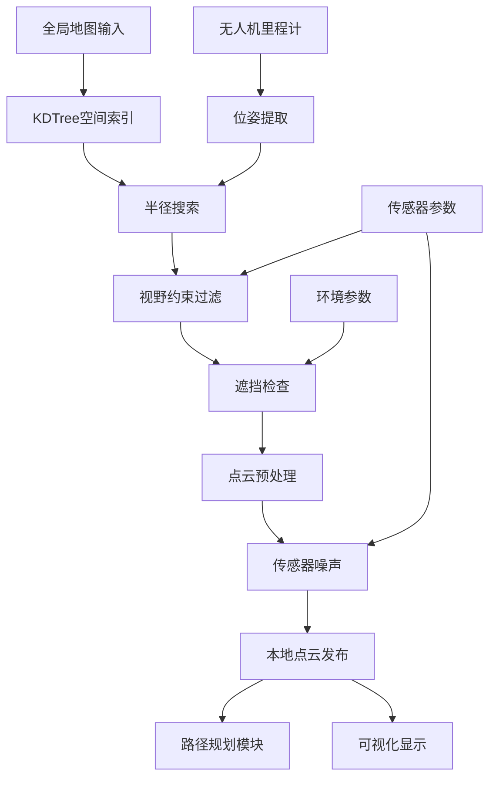

# Local Sensing

## 📖 包概述

本地感知模块是EGO-Planner无人机仿真系统中的核心传感器仿真组件，负责模拟真实无人机上搭载的各种传感器。该模块通过全局地图和无人机位姿信息，实时生成符合物理特性的传感器数据，为路径规划算法提供环境感知能力。

## 🎯 主要功能

### 核心传感器仿真
- **3D激光雷达仿真**: 基于射线投射算法的点云生成
- **深度相机仿真**: 结构化深度图像和点云输出
- **视野约束建模**: 真实传感器FOV和距离限制
- **点云预处理**: 滤波、下采样、离群点移除
- **实时性能优化**: KDTree加速的邻域搜索

### 物理特性建模
```cpp
// 传感器物理模型参数
struct SensorModel {
    double max_range;           // 最大探测距离 [m]
    double min_range;           // 最小探测距离 [m]
    double horizontal_fov;      // 水平视场角 [rad]
    double vertical_fov;        // 垂直视场角 [rad]
    double angular_resolution;  // 角度分辨率 [rad]
    double noise_stddev;        // 测量噪声标准差 [m]
    
    // 视野约束检查
    bool in_fov(const Eigen::Vector3d& point, 
                const Eigen::Matrix3d& rotation) const;
};
```

## 📡 ROS2接口定义

### 订阅话题 (Subscribers)

| 话题名称 | 消息类型 | 频率 | 功能描述 |
|----------|----------|------|----------|
| `global_map` | `sensor_msgs/PointCloud2` | 1Hz | 接收全局环境地图 |
| `odometry` | `nav_msgs/Odometry` | 100Hz | 接收无人机位姿信息 |
| `local_map` | `sensor_msgs/PointCloud2` | 10Hz | 接收局部地图更新 |

### 发布话题 (Publishers)

| 话题名称 | 消息类型 | 频率 | 功能描述 |
|----------|----------|------|----------|
| `cloud` | `sensor_msgs/PointCloud2` | 30Hz | 发布感知点云数据 |
| `depth_cloud` | `sensor_msgs/PointCloud2` | 30Hz | 发布深度点云 |
| `sensor_coverage` | `visualization_msgs/Marker` | 5Hz | 可视化传感器覆盖范围 |

### 参数接口 (Parameters)

| 参数名称 | 类型 | 默认值 | 功能描述 |
|----------|------|--------|----------|
| `sensing_horizon` | double | 5.0 | 传感器最大探测距离 [m] |
| `sensing_rate` | double | 30.0 | 传感器数据发布频率 [Hz] |
| `estimation_rate` | double | 30.0 | 状态估计更新频率 [Hz] |
| `map/x_size` | double | 40.0 | 地图X方向尺寸 [m] |
| `map/y_size` | double | 40.0 | 地图Y方向尺寸 [m] |
| `map/z_size` | double | 5.0 | 地图Z方向尺寸 [m] |

## ⚙️ 核心算法实现

### 1. 3D点云生成算法

```cpp
void renderSensedPoints() {
    if (!has_global_map || !has_odom) return;
    
    // 1. 获取当前无人机状态
    Eigen::Vector3d uav_position = getCurrentPosition();
    Eigen::Matrix3d uav_rotation = getCurrentRotation();
    Eigen::Vector3d forward_direction = uav_rotation.col(0);
    
    // 2. 清空本地点云缓存
    _local_map.points.clear();
    
    // 3. 执行半径搜索获取候选点
    pcl::PointXYZ search_center(uav_position.x(), uav_position.y(), uav_position.z());
    std::vector<int> point_indices;
    std::vector<float> point_distances;
    
    if (_kdtreeLocalMap.radiusSearch(search_center, sensing_horizon,
                                    point_indices, point_distances) > 0) {
        
        // 4. 遍历每个候选点进行视野检查
        for (size_t i = 0; i < point_indices.size(); ++i) {
            pcl::PointXYZ candidate_point = _cloud_all_map.points[point_indices[i]];
            
            // 4.1 高度约束检查 (最大仰角限制)
            double height_diff = abs(candidate_point.z - uav_position.z());
            double horizontal_dist = sqrt(pow(candidate_point.x - uav_position.x(), 2) + 
                                        pow(candidate_point.y - uav_position.y(), 2));
            if (height_diff / horizontal_dist > tan(MAX_ELEVATION_ANGLE)) continue;
            
            // 4.2 视野方向约束检查
            Eigen::Vector3d point_vector(candidate_point.x - uav_position.x(),
                                       candidate_point.y - uav_position.y(),
                                       candidate_point.z - uav_position.z());
            
            // 检查点是否在前向视野内 (半球形FOV)
            if (point_vector.normalized().dot(forward_direction) < cos(FOV_HALF_ANGLE)) continue;
            
            // 4.3 射线投射遮挡检查 (可选)
            if (ENABLE_OCCLUSION_CHECK && isOccluded(uav_position, candidate_point)) continue;
            
            // 4.4 添加噪声模拟
            addSensorNoise(candidate_point);
            
            // 5. 将有效点添加到本地点云
            _local_map.points.push_back(candidate_point);
        }
    }
    
    // 6. 设置点云属性并发布
    _local_map.width = _local_map.points.size();
    _local_map.height = 1;
    _local_map.is_dense = true;
    
    publishPointCloud(_local_map);
}
```

### 2. 点云预处理Pipeline

```cpp
class PointCloudProcessor {
public:
    // 完整的点云处理流水线
    sensor_msgs::msg::PointCloud2 processPointCloud(
        const sensor_msgs::msg::PointCloud2::SharedPtr& input_cloud) {
        
        // 阶段1: 格式转换
        pcl::PointCloud<pcl::PointXYZ> pcl_cloud;
        pcl::fromROSMsg(*input_cloud, pcl_cloud);
        
        // 阶段2: 体素下采样
        pcl::PointCloud<pcl::PointXYZ> downsampled_cloud;
        downsampleCloud(pcl_cloud, downsampled_cloud);
        
        // 阶段3: 离群点移除
        pcl::PointCloud<pcl::PointXYZ> filtered_cloud;
        removeOutliers(downsampled_cloud, filtered_cloud);
        
        // 阶段4: 距离滤波
        pcl::PointCloud<pcl::PointXYZ> range_filtered_cloud;
        applyRangeFilter(filtered_cloud, range_filtered_cloud);
        
        // 阶段5: 转换回ROS消息
        sensor_msgs::msg::PointCloud2 output_cloud;
        pcl::toROSMsg(range_filtered_cloud, output_cloud);
        
        return output_cloud;
    }
    
private:
    void downsampleCloud(const pcl::PointCloud<pcl::PointXYZ>& input,
                        pcl::PointCloud<pcl::PointXYZ>& output) {
        // 体素网格下采样
        pcl::VoxelGrid<pcl::PointXYZ> voxel_filter;
        voxel_filter.setInputCloud(input.makeShared());
        voxel_filter.setLeafSize(voxel_size_, voxel_size_, voxel_size_);
        voxel_filter.filter(output);
    }
    
    void removeOutliers(const pcl::PointCloud<pcl::PointXYZ>& input,
                       pcl::PointCloud<pcl::PointXYZ>& output) {
        // 统计离群点移除
        pcl::StatisticalOutlierRemoval<pcl::PointXYZ> sor;
        sor.setInputCloud(input.makeShared());
        sor.setMeanK(50);                    // 邻域点数
        sor.setStddevMulThresh(1.0);         // 标准差倍数阈值
        sor.filter(output);
    }
    
    void applyRangeFilter(const pcl::PointCloud<pcl::PointXYZ>& input,
                         pcl::PointCloud<pcl::PointXYZ>& output) {
        // 距离范围滤波
        for (const auto& point : input.points) {
            double distance = sqrt(point.x*point.x + point.y*point.y + point.z*point.z);
            if (distance >= min_range_ && distance <= max_range_) {
                output.points.push_back(point);
            }
        }
        output.width = output.points.size();
        output.height = 1;
        output.is_dense = true;
    }
    
    double voxel_size_ = 0.1;      // 体素大小 [m]
    double min_range_ = 0.5;       // 最小距离 [m]
    double max_range_ = 8.0;       // 最大距离 [m]
};
```

### 3. 传感器物理建模

```cpp
class LidarSensor {
private:
    struct LidarParams {
        double horizontal_fov = M_PI;           // 水平视场角 180° 
        double vertical_fov = M_PI/6;           // 垂直视场角 30°
        double max_range = 30.0;                // 最大距离 [m]
        double min_range = 0.1;                 // 最小距离 [m]
        double angular_resolution = 0.01;       // 角度分辨率 [rad]
        double range_noise_stddev = 0.02;       // 距离噪声 [m]
        double angular_noise_stddev = 0.001;    // 角度噪声 [rad]
    };
    
public:
    // 基于物理模型的点云生成
    pcl::PointCloud<pcl::PointXYZ> generateLidarScan(
        const pcl::PointCloud<pcl::PointXYZ>& environment_map,
        const Eigen::Vector3d& sensor_position,
        const Eigen::Matrix3d& sensor_orientation) {
        
        pcl::PointCloud<pcl::PointXYZ> lidar_points;
        
        // 遍历激光雷达的所有射线方向
        for (double azimuth = -params_.horizontal_fov/2; 
             azimuth <= params_.horizontal_fov/2; 
             azimuth += params_.angular_resolution) {
            
            for (double elevation = -params_.vertical_fov/2; 
                 elevation <= params_.vertical_fov/2; 
                 elevation += params_.angular_resolution) {
                
                // 计算射线方向
                Eigen::Vector3d ray_direction = calculateRayDirection(azimuth, elevation);
                ray_direction = sensor_orientation * ray_direction;
                
                // 执行射线投射
                double hit_distance = castRay(environment_map, sensor_position, ray_direction);
                
                if (hit_distance > params_.min_range && hit_distance < params_.max_range) {
                    // 计算击中点坐标
                    Eigen::Vector3d hit_point = sensor_position + hit_distance * ray_direction;
                    
                    // 添加传感器噪声
                    addNoise(hit_point, azimuth, elevation);
                    
                    // 转换为PCL点格式
                    pcl::PointXYZ pcl_point;
                    pcl_point.x = hit_point.x();
                    pcl_point.y = hit_point.y();
                    pcl_point.z = hit_point.z();
                    
                    lidar_points.points.push_back(pcl_point);
                }
            }
        }
        
        lidar_points.width = lidar_points.points.size();
        lidar_points.height = 1;
        lidar_points.is_dense = true;
        
        return lidar_points;
    }
    
private:
    double castRay(const pcl::PointCloud<pcl::PointXYZ>& map,
                   const Eigen::Vector3d& origin,
                   const Eigen::Vector3d& direction) {
        // 实现3D DDA算法或体素遍历进行射线投射
        // 返回第一个障碍物的距离
        // 简化实现：使用KDTree最近邻搜索
        
        const double step_size = 0.1;  // 射线步进大小
        const double max_distance = params_.max_range;
        
        for (double t = params_.min_range; t < max_distance; t += step_size) {
            Eigen::Vector3d sample_point = origin + t * direction;
            
            // 检查该点是否接近障碍物
            if (isNearObstacle(map, sample_point)) {
                return t;
            }
        }
        
        return max_distance;  // 没有击中障碍物
    }
    
    void addNoise(Eigen::Vector3d& point, double azimuth, double elevation) {
        // 添加高斯噪声模拟真实传感器特性
        std::random_device rd;
        std::mt19937 gen(rd());
        std::normal_distribution<double> range_noise(0.0, params_.range_noise_stddev);
        std::normal_distribution<double> angle_noise(0.0, params_.angular_noise_stddev);
        
        // 距离噪声
        double distance = point.norm();
        distance += range_noise(gen);
        
        // 角度噪声
        azimuth += angle_noise(gen);
        elevation += angle_noise(gen);
        
        // 重新计算带噪声的点坐标
        point = distance * Eigen::Vector3d(
            cos(elevation) * cos(azimuth),
            cos(elevation) * sin(azimuth),
            sin(elevation)
        );
    }
    
    LidarParams params_;
};
```

## 🔧 工作Pipeline

### 完整感知流程

```python
def sensing_pipeline():
    """
    本地感知模块完整工作流程
    """
    
    # 阶段1: 初始化
    sensor_model = initialize_sensor_model()
    global_map = load_global_environment_map()
    kdtree = build_spatial_index(global_map)
    
    # 阶段2: 主感知循环 (30Hz)
    while sensing_active:
        # 2.1 获取无人机当前状态
        current_pose = get_current_odometry()
        uav_position = extract_position(current_pose)
        uav_orientation = extract_orientation(current_pose)
        
        # 2.2 视野范围点云提取
        candidate_points = radius_search(kdtree, uav_position, sensing_horizon)
        
        # 2.3 传感器物理约束过滤
        visible_points = []
        for point in candidate_points:
            if sensor_model.in_field_of_view(point, uav_position, uav_orientation):
                if not is_occluded(point, uav_position, global_map):
                    visible_points.append(point)
        
        # 2.4 点云预处理
        processed_cloud = point_cloud_processor.process(visible_points)
        
        # 2.5 传感器噪声添加
        noisy_cloud = add_sensor_noise(processed_cloud, noise_model)
        
        # 2.6 数据发布
        publish_point_cloud(noisy_cloud)
        publish_sensor_coverage_visualization(sensor_model, uav_pose)
        
        # 2.7 性能监控
        update_performance_metrics(processing_time, point_count)
        
        sleep(1.0 / sensing_rate)
```

### 数据流图



## 📋 配置参数

### 传感器参数配置
```yaml
# config/sensor_params.yaml
local_sensing:
  # 基本参数
  sensing_horizon: 8.0              # 感知距离 [m]
  sensing_rate: 30.0                # 感知频率 [Hz]
  estimation_rate: 30.0             # 估计频率 [Hz]
  
  # 激光雷达参数
  lidar:
    max_range: 30.0                 # 最大距离 [m]
    min_range: 0.5                  # 最小距离 [m]
    horizontal_fov: 3.14159         # 水平视场角 [rad]
    vertical_fov: 0.52359           # 垂直视场角 [rad] (±15°)
    angular_resolution: 0.017453    # 角度分辨率 [rad] (1°)
    
  # 噪声模型
  noise:
    enable_noise: true              # 是否启用噪声
    range_stddev: 0.02              # 距离噪声标准差 [m]
    angular_stddev: 0.001           # 角度噪声标准差 [rad]
    outlier_probability: 0.01       # 离群点概率
    
  # 预处理参数
  preprocessing:
    enable_downsampling: true       # 启用下采样
    voxel_size: 0.1                # 体素大小 [m]
    enable_outlier_removal: true    # 启用离群点移除
    outlier_neighbors: 50           # 离群点检测邻域数量
    outlier_std_ratio: 1.0         # 离群点标准差比例
    
  # 性能优化
  performance:
    max_points_per_scan: 10000     # 每次扫描最大点数
    kdtree_leaf_size: 10           # KDTree叶节点大小
    enable_parallel_processing: true # 启用并行处理
```

### 地图参数配置
```yaml
# 环境地图配置
map:
  x_size: 40.0                     # X方向尺寸 [m]
  y_size: 40.0                     # Y方向尺寸 [m]
  z_size: 5.0                      # Z方向尺寸 [m]
  resolution: 0.1                  # 地图分辨率 [m]
  
  # 地图原点
  origin:
    x: -20.0                       # X原点 [m]
    y: -20.0                       # Y原点 [m]
    z: 0.0                         # Z原点 [m]
```

## 🚀 使用方法

### 基本启动

```bash
# 1. 启动本地感知节点
ros2 run local_sensing pointcloud_render_node

# 2. 使用launch文件启动
ros2 launch local_sensing local_sensing.launch.py \
    sensing_horizon:=10.0 \
    sensing_rate:=20.0 \
    use_noise:=true

# 3. 在仿真环境中启动
ros2 launch ego_planner single_run_in_sim.launch.py \
    enable_local_sensing:=true
```

### 编程接口使用

```cpp
// C++接口使用示例
#include <local_sensing/pointcloud_render.h>
#include <rclcpp/rclcpp.hpp>

class SensingUser : public rclcpp::Node {
public:
    SensingUser() : Node("sensing_user") {
        // 订阅感知点云
        cloud_sub_ = create_subscription<sensor_msgs::msg::PointCloud2>(
            "cloud", 10, [this](const sensor_msgs::msg::PointCloud2::SharedPtr msg) {
                process_sensed_cloud(msg);
            });
    }
    
private:
    void process_sensed_cloud(const sensor_msgs::msg::PointCloud2::SharedPtr cloud_msg) {
        // 转换为PCL格式
        pcl::PointCloud<pcl::PointXYZ> pcl_cloud;
        pcl::fromROSMsg(*cloud_msg, pcl_cloud);
        
        RCLCPP_INFO(get_logger(), "Received point cloud with %zu points", 
                   pcl_cloud.points.size());
        
        // 进行进一步处理...
        perform_obstacle_detection(pcl_cloud);
        update_local_map(pcl_cloud);
    }
    
    void perform_obstacle_detection(const pcl::PointCloud<pcl::PointXYZ>& cloud) {
        // 实现障碍物检测逻辑
        for (const auto& point : cloud.points) {
            double distance = sqrt(point.x*point.x + point.y*point.y + point.z*point.z);
            if (distance < safety_distance_) {
                RCLCPP_WARN(get_logger(), "Obstacle detected at distance: %.2f m", distance);
            }
        }
    }
    
    rclcpp::Subscription<sensor_msgs::msg::PointCloud2>::SharedPtr cloud_sub_;
    double safety_distance_ = 1.0;  // 安全距离阈值
};
```

## 🐛 调试工具

### 实时监控
```bash
# 监控点云数据
ros2 topic echo /cloud --field data
ros2 topic hz /cloud

# 检查传感器覆盖范围
ros2 topic echo /sensor_coverage

# 性能分析
ros2 run rqt_plot rqt_plot /diagnostics/local_sensing/processing_time
```

### 可视化工具
```bash
# 启动RViz可视化
rviz2 -d config/local_sensing.rviz

# 实时点云显示
ros2 run pcl_ros pcd_to_pointcloud input.pcd 0.1 _frame_id:=map
```

## ⚠️ 使用注意事项

### 性能考虑
1. **点云密度**: 高密度点云会显著影响处理性能
2. **感知频率**: 频率过高可能导致计算资源不足
3. **内存使用**: 大范围感知需要注意内存管理

### 精度平衡
1. **噪声水平**: 过低的噪声可能不够真实，过高影响算法性能
2. **分辨率设置**: 需要平衡精度和计算效率
3. **视野范围**: 过大的视野可能包含不相关信息

## 📊 性能基准

| 配置 | 感知距离 | 点数/帧 | CPU使用率 | 内存占用 | 延迟 |
|------|----------|---------|-----------|----------|------|
| **低配置** | 5m | <2000 | 10% | 100MB | <10ms |
| **标准配置** | 8m | <5000 | 25% | 200MB | <20ms |
| **高配置** | 15m | <10000 | 50% | 400MB | <40ms |

## 🔗 相关模块

- **so3_quadrotor_simulator**: 提供无人机位姿信息
- **map_generator**: 生成仿真环境地图
- **plan_env**: 使用感知数据进行环境建模
- **ego_planner**: 基于感知数据进行路径规划

---

*本文档更新时间: 2025-01-09*  
*版本: v2.0.0*  
*维护者: EGO-Planner开发团队*