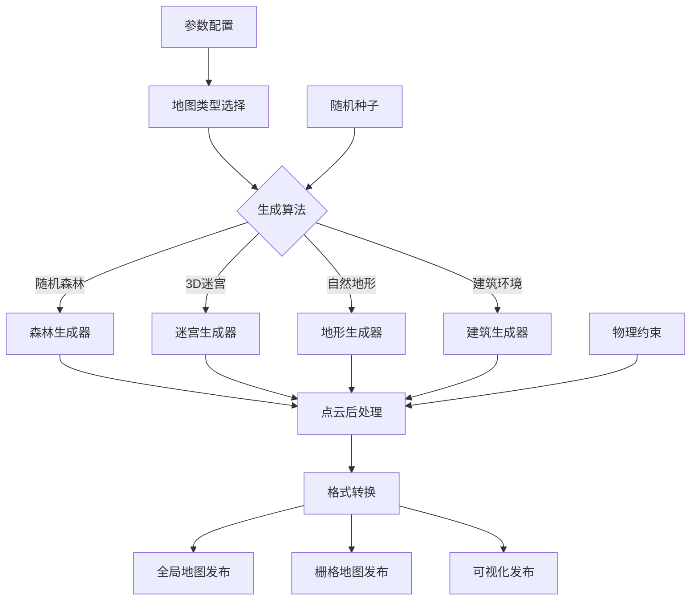

# Map Generator

## 📖 包概述

地图生成器是EGO-Planner仿真系统中的核心环境建模模块，负责生成各种复杂的3D仿真环境地图。该模块提供多种地图生成算法，包括随机障碍物生成、结构化环境构建、自然地形模拟等功能，为无人机路径规划算法提供丰富的测试场景。

## 🎯 主要功能

### 核心地图生成能力
- **随机障碍物生成**: 柏林噪声和随机分布的障碍物场
- **结构化环境**: 建筑物、走廊、房间等规则结构
- **自然地形**: 山丘、峡谷、树林等自然环境
- **动态场景**: 时变障碍物和移动目标
- **多层地图**: 支持多楼层和立体环境

### 地图类型支持
```cpp
// 地图生成器核心类型定义
enum class MapType {
    RANDOM_FOREST,      // 随机森林环境
    MAZE_3D,           // 3D迷宫环境
    CORRIDOR,          // 走廊环境
    ROOM_COMPLEX,      // 房间复合体
    OUTDOOR_TERRAIN,   // 户外地形
    WAREHOUSE,         // 仓库环境
    TUNNEL_SYSTEM,     // 隧道系统
    MIXED_SCENARIO     // 混合场景
};

struct MapParameters {
    double x_size, y_size, z_size;    // 地图尺寸 [m]
    double resolution;                // 分辨率 [m]
    double obstacle_density;          // 障碍物密度 [0-1]
    int random_seed;                  // 随机种子
    MapType type;                     // 地图类型
};
```

## 📡 ROS2接口定义

### 发布话题 (Publishers)

| 话题名称 | 消息类型 | 频率 | 功能描述 |
|----------|----------|------|----------|
| `global_map` | `sensor_msgs/PointCloud2` | 1Hz | 发布全局3D地图点云 |
| `grid_map` | `nav_msgs/OccupancyGrid` | 1Hz | 发布2D栅格地图 |
| `map_visualization` | `visualization_msgs/MarkerArray` | 1Hz | 地图可视化标记 |

### 服务接口 (Services)

| 服务名称 | 服务类型 | 功能描述 |
|----------|----------|----------|
| `generate_map` | `map_generator/GenerateMap` | 生成新地图 |
| `save_map` | `map_generator/SaveMap` | 保存当前地图 |
| `load_map` | `map_generator/LoadMap` | 加载已保存地图 |

### 参数接口 (Parameters)

| 参数名称 | 类型 | 默认值 | 功能描述 |
|----------|------|--------|----------|
| `map/x_size` | double | 20.0 | 地图X方向尺寸 [m] |
| `map/y_size` | double | 20.0 | 地图Y方向尺寸 [m] |
| `map/z_size` | double | 5.0 | 地图Z方向尺寸 [m] |
| `map/resolution` | double | 0.1 | 地图分辨率 [m] |
| `map/obstacle_density` | double | 0.3 | 障碍物密度 |
| `map/type` | string | "random_forest" | 地图类型 |

## ⚙️ 核心算法实现

### 1. 随机森林生成算法

```cpp
class RandomForestGenerator {
public:
    pcl::PointCloud<pcl::PointXYZ> generateForest(const MapParameters& params) {
        pcl::PointCloud<pcl::PointXYZ> forest_cloud;
        
        // 1. 初始化随机数生成器
        std::mt19937 rng(params.random_seed);
        std::uniform_real_distribution<double> x_dist(-params.x_size/2, params.x_size/2);
        std::uniform_real_distribution<double> y_dist(-params.y_size/2, params.y_size/2);
        std::uniform_real_distribution<double> radius_dist(0.1, 0.8);
        std::uniform_real_distribution<double> height_dist(1.0, params.z_size);
        
        // 2. 计算树木数量
        int num_trees = static_cast<int>(params.obstacle_density * 
                                        params.x_size * params.y_size / 4.0);
        
        // 3. 生成随机分布的树木
        for (int i = 0; i < num_trees; ++i) {
            double tree_x = x_dist(rng);
            double tree_y = y_dist(rng);
            double tree_radius = radius_dist(rng);
            double tree_height = height_dist(rng);
            
            // 生成单棵树的点云
            auto tree_points = generateSingleTree(tree_x, tree_y, tree_radius, 
                                                  tree_height, params.resolution);
            
            // 添加到森林点云中
            forest_cloud += tree_points;
        }
        
        // 4. 添加地面点云
        auto ground_points = generateGround(params);
        forest_cloud += ground_points;
        
        return forest_cloud;
    }
    
private:
    pcl::PointCloud<pcl::PointXYZ> generateSingleTree(
        double center_x, double center_y, double radius, 
        double height, double resolution) {
        
        pcl::PointCloud<pcl::PointXYZ> tree_cloud;
        
        // 生成圆柱形树干
        for (double z = 0; z < height; z += resolution) {
            for (double theta = 0; theta < 2*M_PI; theta += 0.1) {
                for (double r = 0; r < radius; r += resolution) {
                    pcl::PointXYZ point;
                    point.x = center_x + r * cos(theta);
                    point.y = center_y + r * sin(theta);
                    point.z = z;
                    tree_cloud.points.push_back(point);
                }
            }
        }
        
        tree_cloud.width = tree_cloud.points.size();
        tree_cloud.height = 1;
        tree_cloud.is_dense = true;
        
        return tree_cloud;
    }
    
    pcl::PointCloud<pcl::PointXYZ> generateGround(const MapParameters& params) {
        pcl::PointCloud<pcl::PointXYZ> ground_cloud;
        
        // 生成地面网格点
        for (double x = -params.x_size/2; x <= params.x_size/2; x += params.resolution) {
            for (double y = -params.y_size/2; y <= params.y_size/2; y += params.resolution) {
                pcl::PointXYZ point;
                point.x = x;
                point.y = y;
                point.z = 0.0;  // 地面高度
                ground_cloud.points.push_back(point);
            }
        }
        
        ground_cloud.width = ground_cloud.points.size();
        ground_cloud.height = 1;
        ground_cloud.is_dense = true;
        
        return ground_cloud;
    }
};
```

### 2. 3D迷宫生成算法

```cpp
class Maze3DGenerator {
public:
    pcl::PointCloud<pcl::PointXYZ> generateMaze(const MapParameters& params) {
        // 1. 生成迷宫网格结构
        MazeGrid maze_grid = generateMazeStructure(params);
        
        // 2. 转换为3D点云
        pcl::PointCloud<pcl::PointXYZ> maze_cloud = gridToPointCloud(maze_grid, params);
        
        // 3. 添加多层结构
        if (params.z_size > 3.0) {
            maze_cloud += generateMultiLevel(maze_grid, params);
        }
        
        return maze_cloud;
    }
    
private:
    struct MazeGrid {
        int width, height;
        std::vector<std::vector<bool>> walls;  // true = 墙壁, false = 通道
        std::vector<std::vector<bool>> visited;
    };
    
    MazeGrid generateMazeStructure(const MapParameters& params) {
        MazeGrid grid;
        grid.width = static_cast<int>(params.x_size / 2.0);   // 每个格子2m
        grid.height = static_cast<int>(params.y_size / 2.0);
        
        // 初始化所有位置为墙壁
        grid.walls.resize(grid.width, std::vector<bool>(grid.height, true));
        grid.visited.resize(grid.width, std::vector<bool>(grid.height, false));
        
        // 使用深度优先搜索生成迷宫
        std::stack<std::pair<int, int>> stack;
        stack.push({1, 1});  // 从(1,1)开始
        grid.visited[1][1] = true;
        grid.walls[1][1] = false;
        
        std::mt19937 rng(42);  // 固定种子确保可重现
        std::vector<std::pair<int, int>> directions = {{0,2}, {2,0}, {0,-2}, {-2,0}};
        
        while (!stack.empty()) {
            auto current = stack.top();
            int x = current.first, y = current.second;
            
            // 查找未访问的邻居
            std::vector<std::pair<int, int>> neighbors;
            for (const auto& dir : directions) {
                int nx = x + dir.first, ny = y + dir.second;
                if (nx > 0 && nx < grid.width-1 && ny > 0 && ny < grid.height-1 &&
                    !grid.visited[nx][ny]) {
                    neighbors.push_back({nx, ny});
                }
            }
            
            if (!neighbors.empty()) {
                // 随机选择一个邻居
                auto next = neighbors[rng() % neighbors.size()];
                int nx = next.first, ny = next.second;
                
                // 移除中间的墙壁
                grid.walls[(x + nx) / 2][(y + ny) / 2] = false;
                grid.walls[nx][ny] = false;
                grid.visited[nx][ny] = true;
                
                stack.push({nx, ny});
            } else {
                stack.pop();
            }
        }
        
        return grid;
    }
    
    pcl::PointCloud<pcl::PointXYZ> gridToPointCloud(
        const MazeGrid& grid, const MapParameters& params) {
        
        pcl::PointCloud<pcl::PointXYZ> cloud;
        double cell_size = 2.0;  // 每个格子2m
        double wall_height = std::min(params.z_size, 3.0);
        
        for (int i = 0; i < grid.width; ++i) {
            for (int j = 0; j < grid.height; ++j) {
                if (grid.walls[i][j]) {
                    // 生成墙壁点云
                    double x_start = -params.x_size/2 + i * cell_size;
                    double y_start = -params.y_size/2 + j * cell_size;
                    
                    for (double x = x_start; x < x_start + cell_size; x += params.resolution) {
                        for (double y = y_start; y < y_start + cell_size; y += params.resolution) {
                            for (double z = 0; z < wall_height; z += params.resolution) {
                                pcl::PointXYZ point;
                                point.x = x;
                                point.y = y;
                                point.z = z;
                                cloud.points.push_back(point);
                            }
                        }
                    }
                }
            }
        }
        
        cloud.width = cloud.points.size();
        cloud.height = 1;
        cloud.is_dense = true;
        
        return cloud;
    }
};
```

### 3. 柏林噪声地形生成

```cpp
class TerrainGenerator {
public:
    pcl::PointCloud<pcl::PointXYZ> generateTerrain(const MapParameters& params) {
        pcl::PointCloud<pcl::PointXYZ> terrain_cloud;
        
        // 1. 初始化柏林噪声生成器
        PerlinNoise noise(params.random_seed);
        
        // 2. 生成地形高度图
        for (double x = -params.x_size/2; x <= params.x_size/2; x += params.resolution) {
            for (double y = -params.y_size/2; y <= params.y_size/2; y += params.resolution) {
                
                // 3. 多尺度噪声叠加
                double height = 0;
                double amplitude = 1.0;
                double frequency = 0.01;
                
                for (int octave = 0; octave < 6; ++octave) {
                    height += amplitude * noise.sample(x * frequency, y * frequency, 0);
                    amplitude *= 0.5;
                    frequency *= 2.0;
                }
                
                // 4. 调整高度范围
                height = (height + 1.0) * 0.5 * params.z_size;  // 归一化到[0, z_size]
                
                // 5. 生成地形点云
                for (double z = 0; z <= height; z += params.resolution) {
                    pcl::PointXYZ point;
                    point.x = x;
                    point.y = y;
                    point.z = z;
                    terrain_cloud.points.push_back(point);
                }
                
                // 6. 添加植被（可选）
                if (height > params.z_size * 0.3 && 
                    noise.sample(x * 0.02, y * 0.02, 1.0) > 0.3) {
                    addVegetation(terrain_cloud, x, y, height, params);
                }
            }
        }
        
        terrain_cloud.width = terrain_cloud.points.size();
        terrain_cloud.height = 1;
        terrain_cloud.is_dense = true;
        
        return terrain_cloud;
    }
    
private:
    class PerlinNoise {
    public:
        PerlinNoise(int seed) {
            // 初始化排列表
            for (int i = 0; i < 256; ++i) {
                p[i] = i;
            }
            
            std::mt19937 rng(seed);
            std::shuffle(p, p + 256, rng);
            
            // 复制排列表
            for (int i = 0; i < 256; ++i) {
                p[256 + i] = p[i];
            }
        }
        
        double sample(double x, double y, double z) {
            // 标准柏林噪声实现
            int X = static_cast<int>(floor(x)) & 255;
            int Y = static_cast<int>(floor(y)) & 255;
            int Z = static_cast<int>(floor(z)) & 255;
            
            x -= floor(x);
            y -= floor(y);
            z -= floor(z);
            
            double u = fade(x);
            double v = fade(y);
            double w = fade(z);
            
            int A = p[X] + Y, AA = p[A] + Z, AB = p[A + 1] + Z;
            int B = p[X + 1] + Y, BA = p[B] + Z, BB = p[B + 1] + Z;
            
            return lerp(w, lerp(v, lerp(u, grad(p[AA], x, y, z),
                                          grad(p[BA], x - 1, y, z)),
                                   lerp(u, grad(p[AB], x, y - 1, z),
                                          grad(p[BB], x - 1, y - 1, z))),
                           lerp(v, lerp(u, grad(p[AA + 1], x, y, z - 1),
                                          grad(p[BA + 1], x - 1, y, z - 1)),
                                   lerp(u, grad(p[AB + 1], x, y - 1, z - 1),
                                          grad(p[BB + 1], x - 1, y - 1, z - 1))));
        }
        
    private:
        int p[512];
        
        double fade(double t) { return t * t * t * (t * (t * 6 - 15) + 10); }
        double lerp(double t, double a, double b) { return a + t * (b - a); }
        double grad(int hash, double x, double y, double z) {
            int h = hash & 15;
            double u = h < 8 ? x : y;
            double v = h < 4 ? y : h == 12 || h == 14 ? x : z;
            return ((h & 1) == 0 ? u : -u) + ((h & 2) == 0 ? v : -v);
        }
    };
    
    void addVegetation(pcl::PointCloud<pcl::PointXYZ>& cloud, 
                      double x, double y, double ground_height, 
                      const MapParameters& params) {
        // 添加简单的植被点云（圆柱形）
        double veg_height = 1.0 + (rand() % 100) / 100.0;  // 1-2m高
        double veg_radius = 0.2 + (rand() % 50) / 100.0;   // 0.2-0.7m半径
        
        for (double h = ground_height; h < ground_height + veg_height; h += params.resolution) {
            for (double theta = 0; theta < 2*M_PI; theta += 0.5) {
                pcl::PointXYZ point;
                point.x = x + veg_radius * cos(theta);
                point.y = y + veg_radius * sin(theta);
                point.z = h;
                cloud.points.push_back(point);
            }
        }
    }
};
```

## 🔧 工作Pipeline

### 完整地图生成流程

```python
def map_generation_pipeline():
    """
    地图生成器完整工作流程
    """
    
    # 阶段1: 参数加载与验证
    params = load_map_parameters()
    validate_parameters(params)
    
    # 阶段2: 选择生成算法
    generator = create_generator(params.map_type)
    
    # 阶段3: 执行地图生成
    if params.map_type == MapType.RANDOM_FOREST:
        point_cloud = RandomForestGenerator().generate(params)
    elif params.map_type == MapType.MAZE_3D:
        point_cloud = Maze3DGenerator().generate(params)
    elif params.map_type == MapType.OUTDOOR_TERRAIN:
        point_cloud = TerrainGenerator().generate(params)
    else:
        point_cloud = DefaultGenerator().generate(params)
    
    # 阶段4: 后处理
    processed_cloud = post_process_map(point_cloud, params)
    
    # 阶段5: 格式转换
    ros_cloud = convert_to_ros_message(processed_cloud)
    grid_map = convert_to_occupancy_grid(processed_cloud, params)
    
    # 阶段6: 数据发布
    publish_global_map(ros_cloud)
    publish_grid_map(grid_map)
    publish_visualization_markers(processed_cloud)
    
    # 阶段7: 保存地图（可选）
    if params.save_map:
        save_map_to_file(processed_cloud, params.output_path)
```

### 地图生成架构图



## 📋 配置参数

### 基础地图参数配置
```yaml
# config/map_generator_params.yaml
map_generator:
  # 地图基本参数
  map:
    x_size: 30.0                    # X方向尺寸 [m]
    y_size: 30.0                    # Y方向尺寸 [m]
    z_size: 4.0                     # Z方向尺寸 [m]
    resolution: 0.1                 # 地图分辨率 [m]
    type: "random_forest"           # 地图类型
    
  # 障碍物参数
  obstacles:
    density: 0.3                    # 障碍物密度 [0-1]
    min_size: 0.2                   # 最小障碍物尺寸 [m]
    max_size: 1.5                   # 最大障碍物尺寸 [m]
    height_variation: true          # 启用高度变化
    
  # 随机参数
  random:
    seed: 42                        # 随机种子
    enable_seed: true               # 启用固定种子
    
  # 发布参数
  publishing:
    global_map_topic: "global_map"  # 全局地图话题
    grid_map_topic: "grid_map"      # 栅格地图话题
    visualization_topic: "map_vis"   # 可视化话题
    publish_rate: 1.0               # 发布频率 [Hz]
```

### 不同地图类型的专用参数
```yaml
# 随机森林参数
random_forest:
  tree_density: 100               # 树木密度 [棵/100m²]
  tree_radius_min: 0.1           # 最小树干半径 [m]
  tree_radius_max: 0.8           # 最大树干半径 [m]
  tree_height_min: 1.0           # 最小树高 [m]
  tree_height_max: 4.0           # 最大树高 [m]
  ground_clearance: 0.5          # 地面间隙 [m]

# 3D迷宫参数
maze_3d:
  corridor_width: 2.0            # 走廊宽度 [m]
  wall_height: 3.0               # 墙壁高度 [m]
  wall_thickness: 0.2            # 墙壁厚度 [m]
  num_levels: 1                  # 楼层数量
  complexity: 0.5                # 迷宫复杂度 [0-1]

# 地形参数
terrain:
  elevation_scale: 2.0           # 高程缩放因子
  noise_octaves: 6               # 噪声倍频程数
  noise_frequency: 0.01          # 基础噪声频率
  vegetation_density: 0.4        # 植被密度 [0-1]
  rock_probability: 0.1          # 岩石概率 [0-1]
```

## 🚀 使用方法

### 基本启动

```bash
# 1. 启动默认地图生成器
ros2 run map_generator map_generator_node

# 2. 使用自定义参数启动
ros2 launch map_generator map_generator.launch.py \
    map_type:="random_forest" \
    x_size:=40.0 \
    y_size:=40.0 \
    obstacle_density:=0.4

# 3. 生成特定类型地图
ros2 launch map_generator maze_generator.launch.py
ros2 launch map_generator terrain_generator.launch.py
```

### 编程接口使用

```cpp
// C++地图生成器使用示例
#include "map_generator/MapGenerator.h"
#include <rclcpp/rclcpp.hpp>

class CustomMapGenerator : public rclcpp::Node {
public:
    CustomMapGenerator() : Node("custom_map_generator") {
        // 创建地图生成器实例
        map_generator_ = std::make_shared<MapGenerator>();
        
        // 设置地图参数
        MapParameters params;
        params.x_size = 50.0;
        params.y_size = 50.0;
        params.z_size = 6.0;
        params.resolution = 0.1;
        params.type = MapType::MIXED_SCENARIO;
        params.obstacle_density = 0.35;
        params.random_seed = 123;
        
        // 生成地图
        auto point_cloud = map_generator_->generateMap(params);
        
        // 发布地图
        map_pub_ = create_publisher<sensor_msgs::msg::PointCloud2>("custom_map", 1);
        
        // 定时发布地图
        timer_ = create_wall_timer(
            std::chrono::seconds(1),
            [this, point_cloud]() {
                sensor_msgs::msg::PointCloud2 ros_cloud;
                pcl::toROSMsg(*point_cloud, ros_cloud);
                ros_cloud.header.frame_id = "map";
                ros_cloud.header.stamp = now();
                map_pub_->publish(ros_cloud);
            });
    }
    
private:
    std::shared_ptr<MapGenerator> map_generator_;
    rclcpp::Publisher<sensor_msgs::msg::PointCloud2>::SharedPtr map_pub_;
    rclcpp::TimerBase::SharedPtr timer_;
};
```

### 服务调用示例

```bash
# 通过服务生成新地图
ros2 service call /generate_map map_generator/GenerateMap \
    "{type: 'random_forest', x_size: 30.0, y_size: 30.0, z_size: 5.0, density: 0.4}"

# 保存当前地图
ros2 service call /save_map map_generator/SaveMap \
    "{filename: '/tmp/my_custom_map.pcd'}"

# 加载已保存的地图
ros2 service call /load_map map_generator/LoadMap \
    "{filename: '/tmp/my_custom_map.pcd'}"
```

## 🐛 调试工具

### 实时监控
```bash
# 监控地图发布
ros2 topic echo /global_map --field data
ros2 topic hz /global_map

# 检查地图尺寸
ros2 topic echo /global_map --field width
ros2 topic echo /global_map --field height

# 可视化地图
rviz2 -d config/map_visualization.rviz
```

### 地图质量评估
```bash
# 检查点云密度
ros2 run map_generator map_analyzer --topic /global_map

# 计算障碍物统计
ros2 run map_generator obstacle_stats --map_file /tmp/map.pcd

# 验证地图连通性
ros2 run map_generator connectivity_check --map_topic /global_map
```

## ⚠️ 使用注意事项

### 性能考虑
1. **地图尺寸**: 大地图会显著影响生成时间和内存使用
2. **分辨率**: 高分辨率地图需要更多计算资源
3. **复杂度**: 复杂地图类型的生成时间较长

### 算法限制
1. **随机性**: 相同参数但不同种子可能产生完全不同的地图
2. **物理合理性**: 生成的地图可能不完全符合物理约束
3. **连通性**: 某些算法可能生成不连通的区域

## 📊 性能基准

| 地图类型 | 尺寸(m³) | 生成时间 | 内存占用 | 点云数量 |
|----------|----------|----------|----------|----------|
| **随机森林** | 30×30×5 | 2.5s | 120MB | ~50k点 |
| **3D迷宫** | 30×30×5 | 1.8s | 80MB | ~35k点 |
| **自然地形** | 30×30×5 | 4.2s | 200MB | ~80k点 |
| **混合场景** | 30×30×5 | 3.5s | 150MB | ~65k点 |

## 🔗 相关模块

- **local_sensing**: 使用生成的地图进行传感器仿真
- **plan_env**: 基于地图进行环境建模
- **ego_planner**: 在生成的地图中进行路径规划
- **mockamap**: 提供地图加载和处理功能

---

*本文档更新时间: 2025-01-09*  
*版本: v2.0.0*  
*维护者: EGO-Planner开发团队* 