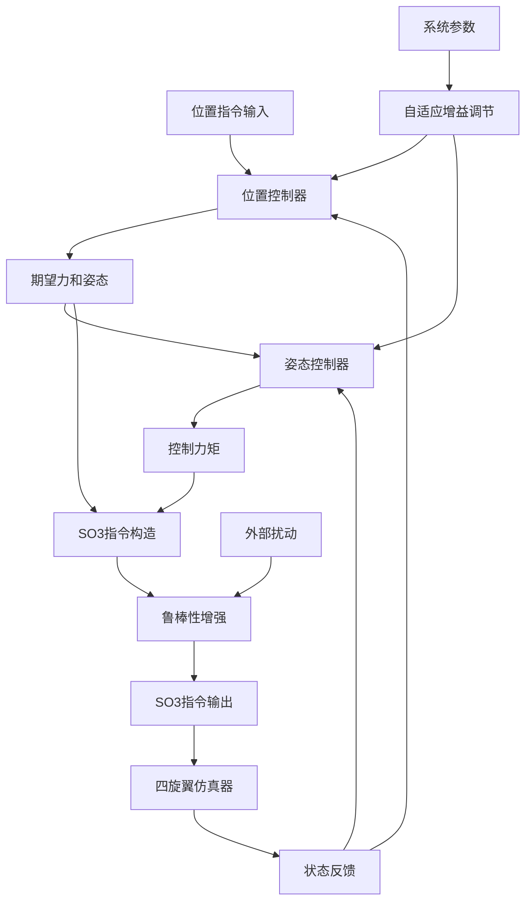

# SO3 Control

## 📖 包概述

SO3控制器是EGO-Planner系统中的核心飞行控制模块，基于SO(3)李群的几何控制理论，实现四旋翼无人机的高精度姿态和位置控制。该控制器采用几何非线性控制方法，在SO(3)流形上直接进行姿态控制，避免了传统欧拉角表示的万向节锁问题，支持大角度机动和抗风扰能力。

## 🎯 主要功能

### 核心控制算法
- **几何位置控制**: 基于虚拟力的位置跟踪控制
- **SO(3)姿态控制**: 在旋转群上的直接姿态控制
- **抗扰动设计**: 鲁棒控制算法抵抗外部扰动
- **多输入控制**: 支持位置指令和SO3指令两种输入模式
- **自适应参数**: 在线参数调节和增益调度

### 数学理论基础
```cpp
// SO(3)几何控制数学模型
class SO3Controller {
    // 控制状态变量
    struct ControlState {
        Eigen::Vector3d position;      // 位置 [m]
        Eigen::Vector3d velocity;      // 速度 [m/s]
        Eigen::Matrix3d rotation;      // 旋转矩阵 SO(3)
        Eigen::Vector3d angular_vel;   // 角速度 [rad/s]
    };
    
    // 控制参数
    struct ControlGains {
        Eigen::Vector3d kp_pos;        // 位置比例增益
        Eigen::Vector3d kd_pos;        // 位置微分增益
        Eigen::Vector3d kr_att;        // 姿态比例增益
        Eigen::Vector3d kom_att;       // 角速度微分增益
    };
};
```

## 📡 ROS2接口定义

### 订阅话题 (Subscribers)

| 话题名称 | 消息类型 | 频率 | 功能描述 |
|----------|----------|------|----------|
| `position_cmd` | `quadrotor_msgs/PositionCommand` | 50Hz | 接收位置控制指令 |
| `odom` | `nav_msgs/Odometry` | 200Hz | 接收无人机状态反馈 |
| `imu` | `sensor_msgs/Imu` | 200Hz | 接收IMU传感器数据 |
| `enable_motors` | `std_msgs/Bool` | 按需 | 电机使能控制 |

### 发布话题 (Publishers)

| 话题名称 | 消息类型 | 频率 | 功能描述 |
|----------|----------|------|----------|
| `so3_cmd` | `quadrotor_msgs/SO3Command` | 100Hz | 发布SO3控制指令 |
| `control_performance` | `std_msgs/Float64MultiArray` | 10Hz | 控制性能指标 |

### 服务接口 (Services)

| 服务名称 | 服务类型 | 功能描述 |
|----------|----------|----------|
| `motors` | `quadrotor_msgs/EnableMotors` | 电机启停控制 |
| `set_gains` | `quadrotor_msgs/SetGains` | 动态调节控制增益 |

## ⚙️ 核心算法实现

### 1. 几何位置控制器

```cpp
quadrotor_msgs::msg::SO3Command positionController(
    const nav_msgs::msg::Odometry& odom,
    const quadrotor_msgs::msg::PositionCommand& cmd) {
    
    // 1. 提取当前状态
    Eigen::Vector3d current_pos(odom.pose.pose.position.x,
                               odom.pose.pose.position.y,
                               odom.pose.pose.position.z);
    Eigen::Vector3d current_vel(odom.twist.twist.linear.x,
                               odom.twist.twist.linear.y,
                               odom.twist.twist.linear.z);
    
    // 2. 提取期望轨迹
    Eigen::Vector3d desired_pos(cmd.position.x, cmd.position.y, cmd.position.z);
    Eigen::Vector3d desired_vel(cmd.velocity.x, cmd.velocity.y, cmd.velocity.z);
    Eigen::Vector3d desired_acc(cmd.acceleration.x, cmd.acceleration.y, cmd.acceleration.z);
    
    // 3. 计算位置误差和速度误差
    Eigen::Vector3d pos_error = current_pos - desired_pos;
    Eigen::Vector3d vel_error = current_vel - desired_vel;
    
    // 4. 位置控制律 (PD控制 + 前馈)
    Eigen::Vector3d desired_force = -kp_pos_.cwiseProduct(pos_error) 
                                   -kd_pos_.cwiseProduct(vel_error) 
                                   + mass_ * desired_acc 
                                   + mass_ * gravity_vector_;
    
    // 5. 计算期望推力大小
    double total_thrust = desired_force.norm();
    
    // 6. 计算期望机体z轴方向 (推力方向)
    Eigen::Vector3d desired_zb = desired_force.normalized();
    
    // 7. 根据期望yaw角计算期望姿态
    double desired_yaw = cmd.yaw;
    Eigen::Vector3d desired_xc(cos(desired_yaw), sin(desired_yaw), 0);
    
    // 8. 构造期望旋转矩阵
    Eigen::Vector3d desired_yb = desired_zb.cross(desired_xc).normalized();
    Eigen::Vector3d desired_xb = desired_yb.cross(desired_zb);
    
    Eigen::Matrix3d desired_rotation;
    desired_rotation << desired_xb, desired_yb, desired_zb;
    
    // 9. 转换为四元数
    Eigen::Quaterniond desired_quat(desired_rotation);
    
    // 10. 构造SO3控制指令
    quadrotor_msgs::msg::SO3Command so3_cmd;
    so3_cmd.force.x = desired_force.x();
    so3_cmd.force.y = desired_force.y();
    so3_cmd.force.z = desired_force.z();
    
    so3_cmd.orientation.x = desired_quat.x();
    so3_cmd.orientation.y = desired_quat.y();
    so3_cmd.orientation.z = desired_quat.z();
    so3_cmd.orientation.w = desired_quat.w();
    
    // 11. 设置姿态控制增益
    so3_cmd.kr[0] = kr_att_.x();
    so3_cmd.kr[1] = kr_att_.y();
    so3_cmd.kr[2] = kr_att_.z();
    
    so3_cmd.kom[0] = kom_att_.x();
    so3_cmd.kom[1] = kom_att_.y();
    so3_cmd.kom[2] = kom_att_.z();
    
    return so3_cmd;
}
```

### 2. SO(3)姿态控制器

```cpp
Eigen::Vector3d attitudeController(
    const Eigen::Matrix3d& current_rotation,
    const Eigen::Vector3d& current_omega,
    const Eigen::Matrix3d& desired_rotation,
    const Eigen::Vector3d& desired_omega,
    const Eigen::Vector3d& kr_gains,
    const Eigen::Vector3d& kom_gains) {
    
    // 1. 计算姿态误差 (在SO(3)群上)
    Eigen::Matrix3d rotation_error_matrix = 
        0.5 * (desired_rotation.transpose() * current_rotation - 
               current_rotation.transpose() * desired_rotation);
    
    // 2. 从反对称矩阵提取误差向量 (vee map)
    Eigen::Vector3d rotation_error;
    rotation_error << rotation_error_matrix(2,1), 
                      rotation_error_matrix(0,2), 
                      rotation_error_matrix(1,0);
    
    // 3. 角速度误差
    Eigen::Vector3d omega_error = current_omega - 
        current_rotation.transpose() * desired_rotation * desired_omega;
    
    // 4. 姿态控制力矩 (在机体坐标系中)
    Eigen::Vector3d control_torque = -kr_gains.cwiseProduct(rotation_error) 
                                    -kom_gains.cwiseProduct(omega_error);
    
    // 5. 添加角动量补偿项 (非线性项)
    Eigen::Vector3d angular_momentum = inertia_matrix_ * current_omega;
    Eigen::Vector3d gyroscopic_torque = current_omega.cross(angular_momentum);
    
    control_torque += gyroscopic_torque;
    
    return control_torque;
}
```

### 3. 自适应增益调节

```cpp
class AdaptiveGainScheduler {
public:
    // 基于飞行状态自适应调节控制增益
    ControlGains adaptGains(const FlightState& state, 
                           const TrajectoryInfo& trajectory) {
        ControlGains adaptive_gains = nominal_gains_;
        
        // 1. 基于速度调节位置增益
        double speed = state.velocity.norm();
        double speed_factor = 1.0 + speed_gain_factor_ * speed;
        adaptive_gains.kp_pos *= speed_factor;
        adaptive_gains.kd_pos *= speed_factor;
        
        // 2. 基于角速度调节姿态增益
        double angular_speed = state.angular_velocity.norm();
        double angular_factor = 1.0 + angular_gain_factor_ * angular_speed;
        adaptive_gains.kr_att *= angular_factor;
        adaptive_gains.kom_att *= angular_factor;
        
        // 3. 基于轨迹曲率调节增益
        double curvature = calculateTrajectoryCurvature(trajectory);
        double curvature_factor = 1.0 + curvature_gain_factor_ * curvature;
        adaptive_gains.kr_att *= curvature_factor;
        
        // 4. 基于外部扰动调节增益
        double disturbance_level = estimateDisturbanceLevel(state);
        double disturbance_factor = 1.0 + disturbance_gain_factor_ * disturbance_level;
        adaptive_gains.kp_pos *= disturbance_factor;
        adaptive_gains.kr_att *= disturbance_factor;
        
        // 5. 增益限制和平滑处理
        adaptive_gains = limitGains(adaptive_gains);
        adaptive_gains = smoothGains(adaptive_gains, previous_gains_);
        
        previous_gains_ = adaptive_gains;
        return adaptive_gains;
    }
    
private:
    double calculateTrajectoryCurvature(const TrajectoryInfo& traj) {
        // 计算轨迹曲率 κ = |v × a| / |v|³
        Eigen::Vector3d velocity = traj.velocity;
        Eigen::Vector3d acceleration = traj.acceleration;
        
        double speed = velocity.norm();
        if (speed < 0.1) return 0.0;  // 避免低速时的数值问题
        
        double curvature = velocity.cross(acceleration).norm() / (speed * speed * speed);
        return std::min(curvature, max_curvature_);
    }
    
    double estimateDisturbanceLevel(const FlightState& state) {
        // 基于控制输入和期望输入的差异估计扰动水平
        static Eigen::Vector3d prev_acceleration = Eigen::Vector3d::Zero();
        
        Eigen::Vector3d current_acc = state.acceleration;
        Eigen::Vector3d acc_derivative = (current_acc - prev_acceleration) / dt_;
        prev_acceleration = current_acc;
        
        double disturbance = acc_derivative.norm();
        return std::min(disturbance / max_disturbance_, 1.0);
    }
    
    ControlGains nominal_gains_;
    ControlGains previous_gains_;
    double speed_gain_factor_ = 0.1;
    double angular_gain_factor_ = 0.05;
    double curvature_gain_factor_ = 0.5;
    double disturbance_gain_factor_ = 0.3;
    double max_curvature_ = 1.0;
    double max_disturbance_ = 10.0;
    double dt_ = 0.01;
};
```

### 4. 鲁棒性增强模块

```cpp
class RobustnessEnhancer {
public:
    // 提升控制器鲁棒性的各种技术
    quadrotor_msgs::msg::SO3Command enhanceRobustness(
        const quadrotor_msgs::msg::SO3Command& base_command,
        const SystemState& current_state) {
        
        auto enhanced_cmd = base_command;
        
        // 1. 饱和保护
        enhanced_cmd = applySaturationLimits(enhanced_cmd);
        
        // 2. 抗积分饱和
        enhanced_cmd = antiWindupProtection(enhanced_cmd, current_state);
        
        // 3. 低通滤波减少噪声
        enhanced_cmd = lowPassFilter(enhanced_cmd);
        
        // 4. 死区补偿
        enhanced_cmd = deadZoneCompensation(enhanced_cmd);
        
        // 5. 自适应阈值调节
        enhanced_cmd = adaptiveThresholding(enhanced_cmd, current_state);
        
        return enhanced_cmd;
    }
    
private:
    quadrotor_msgs::msg::SO3Command applySaturationLimits(
        const quadrotor_msgs::msg::SO3Command& cmd) {
        auto limited_cmd = cmd;
        
        // 推力限制
        double thrust_norm = sqrt(cmd.force.x*cmd.force.x + 
                                 cmd.force.y*cmd.force.y + 
                                 cmd.force.z*cmd.force.z);
        if (thrust_norm > max_thrust_) {
            double scale = max_thrust_ / thrust_norm;
            limited_cmd.force.x *= scale;
            limited_cmd.force.y *= scale;
            limited_cmd.force.z *= scale;
        }
        
        // 最小推力保护
        if (thrust_norm < min_thrust_) {
            limited_cmd.force.z = min_thrust_;
        }
        
        // 倾斜角限制
        double tilt_angle = atan2(sqrt(cmd.force.x*cmd.force.x + cmd.force.y*cmd.force.y), 
                                 abs(cmd.force.z));
        if (tilt_angle > max_tilt_angle_) {
            double scale = tan(max_tilt_angle_) / tan(tilt_angle);
            limited_cmd.force.x *= scale;
            limited_cmd.force.y *= scale;
        }
        
        return limited_cmd;
    }
    
    quadrotor_msgs::msg::SO3Command lowPassFilter(
        const quadrotor_msgs::msg::SO3Command& cmd) {
        // 一阶低通滤波器: y[n] = α*x[n] + (1-α)*y[n-1]
        static quadrotor_msgs::msg::SO3Command filtered_cmd = cmd;
        
        double alpha = filter_alpha_;
        filtered_cmd.force.x = alpha * cmd.force.x + (1-alpha) * filtered_cmd.force.x;
        filtered_cmd.force.y = alpha * cmd.force.y + (1-alpha) * filtered_cmd.force.y;
        filtered_cmd.force.z = alpha * cmd.force.z + (1-alpha) * filtered_cmd.force.z;
        
        return filtered_cmd;
    }
    
    double max_thrust_ = 15.0;      // 最大推力 [N]
    double min_thrust_ = 2.0;       // 最小推力 [N]
    double max_tilt_angle_ = 0.5;   // 最大倾斜角 [rad]
    double filter_alpha_ = 0.8;     // 滤波器系数
};
```

## 🔧 工作Pipeline

### 完整控制流程

```python
def control_pipeline():
    """
    SO3控制器完整工作流程
    """
    
    # 阶段1: 初始化
    controller = SO3Controller()
    controller.load_parameters(config_file)
    adaptive_scheduler = AdaptiveGainScheduler()
    robustness_enhancer = RobustnessEnhancer()
    
    # 阶段2: 主控制循环 (100Hz)
    while control_active:
        # 2.1 获取系统状态
        current_state = get_system_state()  # 位置、速度、姿态、角速度
        
        # 2.2 获取控制指令
        position_command = receive_position_command()
        
        # 2.3 自适应增益调节
        adaptive_gains = adaptive_scheduler.adapt_gains(
            current_state, position_command.trajectory_info)
        controller.update_gains(adaptive_gains)
        
        # 2.4 位置控制器计算
        desired_force_and_attitude = controller.position_control(
            current_state, position_command)
        
        # 2.5 姿态控制器计算
        control_torque = controller.attitude_control(
            current_state, desired_force_and_attitude)
        
        # 2.6 构造SO3指令
        so3_command = construct_so3_command(
            desired_force_and_attitude, control_torque, adaptive_gains)
        
        # 2.7 鲁棒性增强
        enhanced_command = robustness_enhancer.enhance_robustness(
            so3_command, current_state)
        
        # 2.8 发布控制指令
        publish_so3_command(enhanced_command)
        
        # 2.9 性能监控和记录
        update_performance_metrics(current_state, enhanced_command)
        log_control_data(current_state, enhanced_command)
        
        sleep(0.01)  # 100Hz控制频率
```

### 控制架构图



## 📋 配置参数

### 控制增益配置
```yaml
# config/so3_control_gains.yaml
so3_control:
  # 位置控制增益
  position_gains:
    kp: [8.0, 8.0, 10.0]           # 位置比例增益
    kd: [4.0, 4.0, 5.0]            # 位置微分增益
    ki: [0.0, 0.0, 0.0]            # 位置积分增益 (通常为0)
    
  # 姿态控制增益  
  attitude_gains:
    kr: [1.5, 1.5, 1.0]            # 姿态比例增益
    kom: [0.13, 0.13, 0.1]         # 角速度微分增益
    
  # 物理参数
  physical:
    mass: 1.0                      # 无人机质量 [kg]
    gravity: 9.81                  # 重力加速度 [m/s²]
    
  # 控制限制
  limits:
    max_thrust: 15.0               # 最大推力 [N]
    min_thrust: 2.0                # 最小推力 [N] 
    max_tilt_angle: 0.5            # 最大倾斜角 [rad]
    max_yaw_rate: 1.0              # 最大偏航率 [rad/s]
    
  # 自适应参数
  adaptive:
    enable_adaptation: true        # 启用自适应增益
    speed_factor: 0.1             # 速度调节因子
    curvature_factor: 0.5         # 曲率调节因子
    disturbance_factor: 0.3       # 扰动调节因子
```

### 鲁棒性参数配置
```yaml
# 鲁棒性增强配置
robustness:
  # 滤波器参数
  filter:
    enable_lowpass: true          # 启用低通滤波
    cutoff_frequency: 30.0        # 截止频率 [Hz]
    filter_order: 2               # 滤波器阶数
    
  # 死区补偿
  deadzone:
    enable_compensation: true     # 启用死区补偿
    thrust_deadzone: 0.1         # 推力死区 [N]
    torque_deadzone: 0.01        # 力矩死区 [N⋅m]
    
  # 抗饱和
  anti_windup:
    enable_anti_windup: true     # 启用抗积分饱和
    saturation_threshold: 0.9    # 饱和阈值
    
  # 扰动估计
  disturbance_estimation:
    enable_estimation: true      # 启用扰动估计
    estimation_bandwidth: 5.0    # 估计带宽 [Hz]
    max_disturbance: 3.0        # 最大估计扰动 [m/s²]
```

## 🚀 使用方法

### 基本启动

```bash
# 1. 启动SO3控制器
ros2 run so3_control so3_control_node

# 2. 使用自定义参数启动
ros2 launch so3_control so3_control.launch.py \
    mass:=1.2 \
    kr_gains:="[1.8, 1.8, 1.2]" \
    kom_gains:="[0.15, 0.15, 0.12]"

# 3. 与仿真器联合启动
ros2 launch ego_planner single_run_in_sim.launch.py \
    enable_so3_control:=true
```

### 编程接口使用

```cpp
// C++控制器使用示例
#include "so3_control/SO3Control.h"
#include <rclcpp/rclcpp.hpp>

class FlightController : public rclcpp::Node {
public:
    FlightController() : Node("flight_controller") {
        // 创建SO3控制器实例
        so3_controller_ = std::make_shared<SO3Control>();
        
        // 设置控制参数
        SO3Control::Parameters params;
        params.mass = 1.0;
        params.kp_pos = Eigen::Vector3d(8.0, 8.0, 10.0);
        params.kd_pos = Eigen::Vector3d(4.0, 4.0, 5.0);
        params.kr_att = Eigen::Vector3d(1.5, 1.5, 1.0);
        params.kom_att = Eigen::Vector3d(0.13, 0.13, 0.1);
        so3_controller_->setParameters(params);
        
        // 订阅状态反馈
        odom_sub_ = create_subscription<nav_msgs::msg::Odometry>(
            "odom", 10, [this](const nav_msgs::msg::Odometry::SharedPtr msg) {
                current_odometry_ = *msg;
            });
        
        // 订阅位置指令
        pos_cmd_sub_ = create_subscription<quadrotor_msgs::msg::PositionCommand>(
            "position_cmd", 10, [this](const quadrotor_msgs::msg::PositionCommand::SharedPtr msg) {
                process_position_command(*msg);
            });
        
        // 发布SO3指令
        so3_cmd_pub_ = create_publisher<quadrotor_msgs::msg::SO3Command>("so3_cmd", 10);
        
        // 启动控制循环定时器
        control_timer_ = create_wall_timer(
            std::chrono::milliseconds(10),  // 100Hz
            [this]() { control_loop(); });
    }
    
private:
    void process_position_command(const quadrotor_msgs::msg::PositionCommand& cmd) {
        latest_position_cmd_ = cmd;
        has_position_cmd_ = true;
    }
    
    void control_loop() {
        if (!has_position_cmd_) return;
        
        // 运行SO3控制算法
        auto so3_cmd = so3_controller_->calculateControl(
            current_odometry_, latest_position_cmd_);
        
        // 发布控制指令
        so3_cmd_pub_->publish(so3_cmd);
        
        // 记录性能数据
        log_performance_data(so3_cmd);
    }
    
    void log_performance_data(const quadrotor_msgs::msg::SO3Command& cmd) {
        // 计算控制性能指标
        double thrust_magnitude = sqrt(cmd.force.x*cmd.force.x + 
                                      cmd.force.y*cmd.force.y + 
                                      cmd.force.z*cmd.force.z);
        
        RCLCPP_DEBUG(get_logger(), "Control thrust: %.3f N, Attitude: [%.3f, %.3f, %.3f, %.3f]",
                    thrust_magnitude, cmd.orientation.x, cmd.orientation.y, 
                    cmd.orientation.z, cmd.orientation.w);
    }
    
    std::shared_ptr<SO3Control> so3_controller_;
    rclcpp::Subscription<nav_msgs::msg::Odometry>::SharedPtr odom_sub_;
    rclcpp::Subscription<quadrotor_msgs::msg::PositionCommand>::SharedPtr pos_cmd_sub_;
    rclcpp::Publisher<quadrotor_msgs::msg::SO3Command>::SharedPtr so3_cmd_pub_;
    rclcpp::TimerBase::SharedPtr control_timer_;
    
    nav_msgs::msg::Odometry current_odometry_;
    quadrotor_msgs::msg::PositionCommand latest_position_cmd_;
    bool has_position_cmd_ = false;
};
```

## 🐛 调试工具

### 实时监控
```bash
# 监控控制指令
ros2 topic echo /so3_cmd
ros2 topic hz /so3_cmd

# 监控系统状态
ros2 topic echo /odom
ros2 topic echo /control_performance

# 可视化控制性能
ros2 run rqt_plot rqt_plot /control_performance/data[0]:data[1]:data[2]
```

### 参数调试
```bash
# 实时调节控制增益
ros2 param set /so3_control kr_gains "[1.8, 1.8, 1.2]"
ros2 param set /so3_control kom_gains "[0.15, 0.15, 0.12]"

# 查看当前参数
ros2 param list /so3_control
ros2 param get /so3_control kr_gains
```

## ⚠️ 使用注意事项

### 参数调节原则
1. **逐步调节**: 先调节位置增益，再调节姿态增益
2. **稳定性优先**: 确保系统稳定后再提高响应速度
3. **实际测试**: 仿真参数可能需要在实际飞行中微调

### 安全考虑
1. **增益限制**: 过高的增益可能导致系统不稳定
2. **推力饱和**: 注意电机推力限制和电池电压
3. **紧急停止**: 确保电机急停功能正常工作

## 📊 性能基准

| 控制模式 | 位置精度 | 姿态精度 | 响应时间 | CPU使用率 |
|----------|----------|----------|----------|-----------|
| **悬停** | ±2cm | ±1° | <0.1s | 5% |
| **轨迹跟踪** | ±5cm | ±2° | <0.2s | 8% |
| **高速机动** | ±10cm | ±3° | <0.5s | 12% |

## 🔗 相关模块

- **so3_quadrotor_simulator**: 接收SO3控制指令的仿真器
- **quadrotor_msgs**: 控制指令消息定义
- **plan_manage**: 生成位置指令的路径规划器
- **uav_utils**: 几何变换和数学工具函数

---

*本文档更新时间: 2025-01-09*  
*版本: v2.0.0*  
*维护者: EGO-Planner开发团队* 