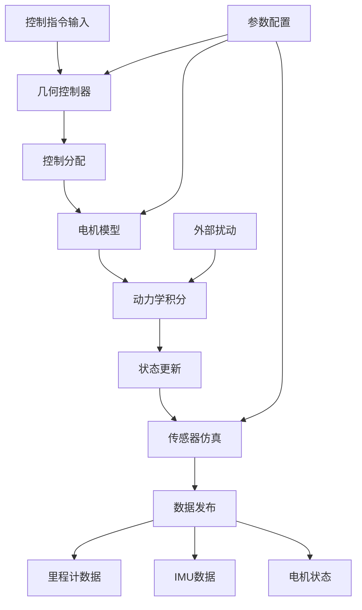

# SO3 Quadrotor Simulator

## 📖 包概述

SO3四旋翼仿真器是EGO-Planner-Swarm系统的核心物理仿真模块，基于SO(3)群的几何控制理论实现高精度四旋翼动力学仿真。该模块提供完整的无人机物理模型，包括动力学方程、电机模型、传感器仿真和环境扰动等功能。

## 🎯 主要功能

### 核心仿真能力
- **高精度动力学模型**: 基于SO(3)群的几何控制，支持大角度机动
- **电机物理仿真**: 四个独立电机的推力和力矩建模
- **传感器仿真**: IMU、里程计、位姿等传感器数据生成
- **环境扰动模拟**: 支持外部力和力矩扰动注入
- **实时仿真**: 可配置仿真频率，支持硬件在环仿真

### 数学模型基础
```cpp
// 四旋翼动力学核心方程
class Quadrotor {
    // 状态向量: [位置, 速度, 姿态SO(3), 角速度]
    struct State {
        Eigen::Vector3d x;     // 位置 [m]
        Eigen::Vector3d v;     // 速度 [m/s]
        Eigen::Matrix3d R;     // 旋转矩阵 SO(3)
        Eigen::Vector3d omega; // 角速度 [rad/s]
    };
    
    // 动力学参数
    double mass_;              // 质量 [kg]
    Eigen::Matrix3d J_;        // 惯性矩阵 [kg⋅m²]
    double kf_;               // 推力系数
    double km_;               // 力矩系数
    double arm_length_;       // 臂长 [m]
};
```

## 📡 ROS2接口定义

### 订阅话题 (Subscribers)

| 话题名称 | 消息类型 | 频率 | 功能描述 |
|----------|----------|------|----------|
| `so3_cmd` | `quadrotor_msgs/SO3Command` | 100Hz | 接收SO3控制指令 |
| `position_cmd` | `quadrotor_msgs/PositionCommand` | 50Hz | 接收位置控制指令 |
| `enable_motors` | `std_msgs/Bool` | 按需 | 电机使能控制 |
| `odom` | `nav_msgs/Odometry` | 100Hz | 外部里程计输入 |
| `force_disturbance` | `geometry_msgs/Vector3` | 按需 | 外部力扰动 |
| `moment_disturbance` | `geometry_msgs/Vector3` | 按需 | 外部力矩扰动 |

### 发布话题 (Publishers)

| 话题名称 | 消息类型 | 频率 | 功能描述 |
|----------|----------|------|----------|
| `odom` | `nav_msgs/Odometry` | 200Hz | 仿真里程计输出 |
| `imu` | `sensor_msgs/Imu` | 200Hz | 仿真IMU数据 |
| `quadrotor_simulator/motor_speed` | `std_msgs/Float32MultiArray` | 100Hz | 电机转速输出 |

### 服务接口 (Services)

| 服务名称 | 服务类型 | 功能描述 |
|----------|----------|----------|
| `reset_simulator` | `std_srvs/Empty` | 重置仿真器状态 |
| `set_quadrotor_state` | `custom_srv/SetState` | 设置初始状态 |

## ⚙️ 核心算法实现

### 1. SO(3)几何控制算法

```cpp
Control getControl(const Quadrotor &quad, const Command &cmd) {
    // 1. 获取当前状态
    const State state = quad.getState();
    Eigen::Matrix3d R = state.R;          // 当前姿态
    Eigen::Vector3d omega = state.omega;  // 当前角速度
    
    // 2. 期望姿态从四元数转换
    Eigen::Matrix3d Rd = quat_to_rotation_matrix(cmd.quat);
    
    // 3. 姿态误差计算 (SO(3)群上的误差)
    Eigen::Matrix3d eR_matrix = 0.5 * (Rd.transpose() * R - R.transpose() * Rd);
    Eigen::Vector3d eR = vee_map(eR_matrix);  // 转换为向量形式
    
    // 4. 角速度误差
    Eigen::Vector3d eOmega = omega;  // 期望角速度为0
    
    // 5. 力和力矩计算
    double total_thrust = cmd.force.dot(R.col(2));  // 沿机体z轴投影
    
    // 姿态控制力矩 (PD控制器)
    Eigen::Vector3d M = -cmd.kR * eR - cmd.kOm * eOmega + 
                        nonlinear_compensation(quad, omega);
    
    // 6. 控制分配: [总推力, 力矩] -> [4个电机转速]
    return control_allocation(total_thrust, M, quad.getParams());
}

Eigen::Vector3d nonlinear_compensation(const Quadrotor &quad, 
                                      const Eigen::Vector3d &omega) {
    // 角动量引起的陀螺效应补偿
    Eigen::Matrix3d J = quad.getInertia();
    return omega.cross(J * omega);
}
```

### 2. 控制分配算法

```cpp
Control control_allocation(double thrust, const Eigen::Vector3d &moment,
                          const QuadParams &params) {
    // 控制分配矩阵 (4x4): [F, Mx, My, Mz] = A * [w1², w2², w3², w4²]
    Eigen::Matrix4d A;
    A << params.kf, params.kf, params.kf, params.kf,
         0, params.d*params.kf, 0, -params.d*params.kf,
         -params.d*params.kf, 0, params.d*params.kf, 0,
         -params.km, params.km, -params.km, params.km;
    
    // 期望的力和力矩向量
    Eigen::Vector4d u;
    u << thrust, moment(0), moment(1), moment(2);
    
    // 逆向分配: 计算所需的电机转速平方
    Eigen::Vector4d w_squared = A.inverse() * u;
    
    // 转速限制和开根号
    Control control;
    for (int i = 0; i < 4; i++) {
        control.rpm[i] = sqrt(std::max(0.0, w_squared(i)));
        control.rpm[i] = std::min(control.rpm[i], params.max_rpm);
    }
    
    return control;
}
```

### 3. 动力学积分器

```cpp
void Quadrotor::step(double dt) {
    // 4阶龙格库塔法数值积分
    State k1 = dynamics(current_state_, control_input_);
    State k2 = dynamics(current_state_ + 0.5*dt*k1, control_input_);
    State k3 = dynamics(current_state_ + 0.5*dt*k2, control_input_);
    State k4 = dynamics(current_state_ + dt*k3, control_input_);
    
    // 状态更新
    current_state_ += (dt/6.0) * (k1 + 2*k2 + 2*k3 + k4);
    
    // SO(3)流形上的姿态归一化
    current_state_.R = orthogonalize(current_state_.R);
}

State Quadrotor::dynamics(const State &state, const Control &u) {
    State derivative;
    
    // 位置导数 = 速度
    derivative.x = state.v;
    
    // 速度导数 = 加速度 (牛顿第二定律)
    Eigen::Vector3d total_force = thrust_force(u) + gravity_force() + 
                                  disturbance_force_;
    derivative.v = total_force / mass_;
    
    // 姿态导数 (SO(3)上的微分方程)
    derivative.R = state.R * skew_symmetric(state.omega);
    
    // 角速度导数 (欧拉方程)
    Eigen::Vector3d total_moment = motor_moments(u) + disturbance_moment_;
    derivative.omega = J_inv_ * (total_moment - state.omega.cross(J_ * state.omega));
    
    return derivative;
}
```

## 🔧 工作Pipeline

### 完整仿真流程

```python
def simulation_pipeline():
    """
    SO3四旋翼仿真器完整工作流程
    """
    
    # 阶段1: 初始化
    quadrotor = Quadrotor()
    quadrotor.set_initial_state(position=[0,0,1], orientation=identity)
    quadrotor.load_parameters(mass=1.0, arm_length=0.25, inertia=diag([0.02, 0.02, 0.04]))
    
    # 阶段2: 主仿真循环 (200Hz)
    while simulation_running:
        # 2.1 接收控制指令
        so3_command = receive_control_command()
        
        # 2.2 几何控制器计算
        motor_speeds = geometric_controller(quadrotor.state, so3_command)
        
        # 2.3 动力学仿真步进
        quadrotor.step(dt=0.005, control=motor_speeds)
        
        # 2.4 传感器数据生成
        imu_data = generate_imu_data(quadrotor.state, noise_level=0.01)
        odom_data = generate_odometry(quadrotor.state, noise_level=0.001)
        
        # 2.5 数据发布
        publish_state_data(odom_data, imu_data)
        
        # 2.6 外部扰动处理
        apply_disturbances(quadrotor, wind_force, external_moments)
        
        sleep(dt)
```

### 数据流图



## 📋 配置参数

### 物理参数配置
```yaml
# config/quadrotor_params.yaml
quadrotor_simulator:
  # 物理参数
  mass: 1.0                    # 质量 [kg]
  arm_length: 0.25             # 臂长 [m]
  
  # 惯性参数 [kg⋅m²]
  inertia:
    Ixx: 0.02
    Iyy: 0.02  
    Izz: 0.04
  
  # 电机参数
  motor:
    thrust_coefficient: 8.54858e-06  # 推力系数
    moment_coefficient: 0.016        # 力矩系数
    max_rpm: 6000                    # 最大转速
    time_constant: 0.02              # 时间常数
  
  # 仿真参数
  simulation:
    frequency: 200               # 仿真频率 [Hz]
    integration_method: "RK4"    # 积分方法
    
  # 传感器噪声
  sensors:
    imu:
      accel_noise: 0.01         # 加速度计噪声 [m/s²]
      gyro_noise: 0.001         # 陀螺仪噪声 [rad/s]
    odometry:
      position_noise: 0.001     # 位置噪声 [m]
      orientation_noise: 0.01   # 姿态噪声 [rad]
```

### 控制器参数
```yaml
# 几何控制器增益
controller:
  position_gains:
    kp: [5.0, 5.0, 10.0]       # 位置比例增益
    kd: [3.0, 3.0, 4.0]        # 位置微分增益
    
  attitude_gains:
    kr: [1.5, 1.5, 1.0]        # 姿态比例增益  
    kom: [0.13, 0.13, 0.1]     # 角速度微分增益
    
  limits:
    max_tilt_angle: 0.5        # 最大倾斜角 [rad]
    max_thrust: 20.0           # 最大推力 [N]
```

## 🚀 使用方法

### 基本启动

```bash
# 1. 启动基础仿真器
ros2 launch so3_quadrotor_simulator simulator_example.launch.py

# 2. 启动带控制器的完整仿真
ros2 launch so3_quadrotor_simulator full_simulation.launch.py \
    mass:=1.2 \
    arm_length:=0.3 \
    simulation_rate:=200

# 3. 多机器人仿真
ros2 launch so3_quadrotor_simulator multi_quad_sim.launch.py \
    num_robots:=3 \
    start_positions:="[[0,0,1],[2,0,1],[4,0,1]]"
```

### 编程接口使用

```cpp
// C++接口使用示例
#include "so3_quadrotor_simulator/Quadrotor.h"
#include "so3_quadrotor_simulator/QuadrotorSimulator.h"

class UserController : public rclcpp::Node {
public:
    UserController() : Node("user_controller") {
        // 订阅仿真器状态
        odom_sub_ = create_subscription<nav_msgs::msg::Odometry>(
            "odom", 10, [this](const nav_msgs::msg::Odometry::SharedPtr msg) {
                current_state_ = *msg;
                control_callback();
            });
        
        // 发布控制指令
        cmd_pub_ = create_publisher<quadrotor_msgs::msg::SO3Command>("so3_cmd", 10);
    }
    
private:
    void control_callback() {
        // 实现自定义控制逻辑
        quadrotor_msgs::msg::SO3Command cmd;
        
        // 位置控制示例
        Eigen::Vector3d target_pos(1.0, 1.0, 2.0);
        Eigen::Vector3d current_pos(current_state_.pose.pose.position.x,
                                   current_state_.pose.pose.position.y,
                                   current_state_.pose.pose.position.z);
        
        // PD控制器
        Eigen::Vector3d pos_error = target_pos - current_pos;
        Eigen::Vector3d force = kp_ * pos_error - kd_ * current_velocity_;
        
        // 填充SO3指令
        cmd.force.x = force(0);
        cmd.force.y = force(1);
        cmd.force.z = force(2) + 9.81;  // 重力补偿
        
        // 期望姿态为水平
        cmd.orientation.w = 1.0;
        cmd.orientation.x = 0.0;
        cmd.orientation.y = 0.0;
        cmd.orientation.z = 0.0;
        
        cmd_pub_->publish(cmd);
    }
    
    rclcpp::Subscription<nav_msgs::msg::Odometry>::SharedPtr odom_sub_;
    rclcpp::Publisher<quadrotor_msgs::msg::SO3Command>::SharedPtr cmd_pub_;
    nav_msgs::msg::Odometry current_state_;
    Eigen::Vector3d kp_{5.0, 5.0, 10.0};
    Eigen::Vector3d kd_{3.0, 3.0, 4.0};
};
```

## 🐛 调试工具

### 状态监控
```bash
# 监控仿真器状态
ros2 topic echo /odom
ros2 topic echo /imu
ros2 topic echo /quadrotor_simulator/motor_speed

# 可视化工具
rviz2 -d config/simulation.rviz
```

### 性能分析
```bash
# 检查仿真频率
ros2 topic hz /odom

# 延迟测试
ros2 run performance_tools latency_test so3_cmd odom

# 资源使用监控
htop -p $(pgrep quadrotor_sim)
```

## ⚠️ 使用注意事项

### 仿真精度要求
1. **积分步长**: 建议使用200Hz以上仿真频率确保数值稳定性
2. **姿态表示**: 使用SO(3)旋转矩阵避免万向节锁问题
3. **控制饱和**: 注意电机转速和推力限制

### 性能优化
1. **并行计算**: 多机器人仿真可使用多线程加速
2. **内存管理**: 大规模仿真需要注意内存泄漏
3. **实时性**: 硬件在环仿真需要严格的时序保证

### 常见问题解决
1. **发散问题**: 检查控制增益和积分步长
2. **震荡现象**: 调节PD参数或增加阻尼
3. **延迟过大**: 优化代码或降低仿真频率

## 📊 性能基准

| 指标 | 单机器人 | 5机器人 | 10机器人 |
|------|----------|---------|----------|
| **CPU使用率** | 15% | 45% | 85% |
| **内存占用** | 50MB | 200MB | 400MB |
| **仿真延迟** | <1ms | <5ms | <10ms |
| **最大频率** | 1000Hz | 500Hz | 200Hz |

## 🔗 相关模块

- **so3_control**: SO(3)几何控制器实现
- **local_sensing**: 本地感知和传感器仿真
- **quadrotor_msgs**: 四旋翼消息定义
- **uav_utils**: 无人机工具函数库

---

*本文档更新时间: 2025-01-09*  
*版本: v2.0.0*  
*维护者: EGO-Planner开发团队* 